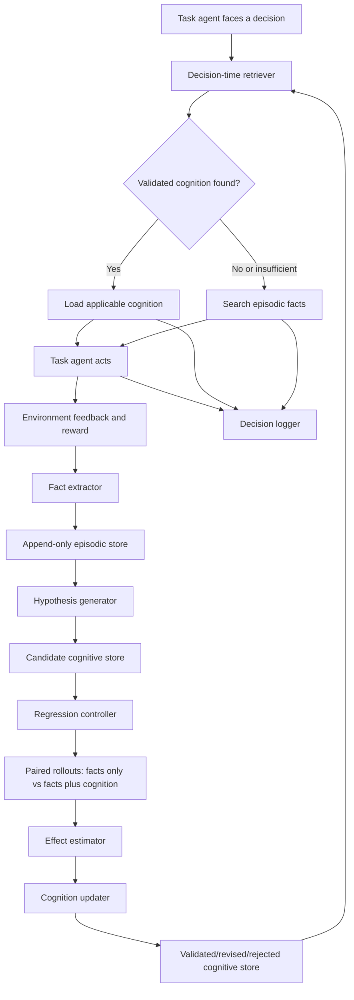

# Agentic Hierarchical Memory for LatentGym

## Implementation and Experiment Plan

**Status:** working design specification  
**Initial environment:** `number_guessing`  
**Primary objective:** implement and evaluate an explicit agentic memory lifecycle before training any RL policy  
**Longer-term objective:** use the same evaluation framework for RL-managed memory and, later, latent or differentiable memory architectures

---

## 0. Instructions for Cursor

Before editing code:

1. Read the repository's top-level `README.md`.
2. Read `docs/getting_started.md`.
3. Read `latentgym/eval/README.md`, especially:
   - single-agent evaluation flow;
   - `APIRunner`;
   - `TrajectoryResult` and `EpisodeOutcome`;
   - saved trajectory and reporting formats.
4. Read `latentgym/envs/number_guessing/README.md` and the corresponding environment implementation.
5. Read:
   - `latentgym/eval/single_agent/api_runner.py`;
   - `latentgym/eval/types.py`;
   - `latentgym/eval/orchestrator.py`;
   - `latentgym/eval/model_interface.py`.
6. Locate the exact code path that detects an episode boundary inside a multi-episode trajectory.
7. Do **not** modify the original runner until the baseline evaluation has been reproduced.
8. Implement the new method in isolated files and preserve existing APIs wherever possible.
9. Do **not** begin RL training in the first implementation.
10. Never expose hidden `ground_truth` or future episode configurations to the task agent, event extractor, hypothesis generator, or memory retriever. Hidden information may be used only by the evaluator.

The repository documentation may still refer to an older working-directory name such as `meta-rl`. Use the actual cloned repository root as the working directory.

---

## 1. Research Motivation

LatentGym currently evaluates whether an agent can learn across a sequence of tasks sharing a hidden latent structure. In the standard single-agent setup, the agent can benefit from the accumulated interaction context.

This project replaces implicit full-history adaptation with an explicit, auditable memory lifecycle:

```text
interaction trajectory
    -> verified episodic facts
    -> candidate cognitive memories
    -> controlled regression validation
    -> validated, revised, or rejected cognition
    -> decision-time retrieval
```

The central safety principle is:

> Memory may be useless, but it should not be toxic.

A false cognitive rule can systematically steer future decisions in the wrong direction. Therefore:

- factual records and inferred rules must be stored separately;
- cognitive memories must carry an explicit scope and provenance;
- candidate cognitions must be tested through controlled downstream rollouts;
- every decision must record which memories were loaded and used;
- incorrect cognitions must be locatable, reversible, and rebuildable from facts.

---

## 2. Main Research Questions

### RQ1: Can compact episodic memory replace full interaction history?

Compare:

- no cross-task memory;
- full interaction history;
- compact verified episodic facts.

### RQ2: Does cognitive consolidation add value beyond episodic facts?

Under identical episodic evidence, compare:

- episodic facts only;
- episodic facts plus one candidate cognition.

### RQ3: Can regression validation prevent toxic cognition?

Compare:

- naive LLM-generated cognition accepted immediately;
- evidence-gated cognition with provenance and scope;
- regression-validated cognition.

### RQ4: What kinds of failure occur?

Separate at least:

- event extraction failure;
- overgeneralized cognition;
- incorrect scope;
- retrieval failure;
- memory-utilization failure;
- environment drift or stale cognition;
- context pollution from irrelevant facts.

### RQ5: Which decisions should eventually be learned by RL?

Do not assume the answer in advance. Use the agentic system to determine whether the main bottleneck is:

- candidate generation;
- promotion or rejection;
- scope revision;
- retrieval;
- forgetting or invalidation;
- experiment selection.

---

## 3. Memory Hierarchy

The general architecture has three conceptual layers, but the first LatentGym implementation should focus on the bottom two.

### 3.1 Soul layer

Stable identity, goals, style, and hard constraints. Human-editable; the AI may propose changes but should not silently modify them.

For the initial Number Guessing experiment, keep this layer fixed and out of scope.

### 3.2 Cognitive layer

Reusable beliefs, strategies, or rules inferred from experience.

Every cognitive memory must contain:

- `claim`: what the system believes;
- `scope`: conditions under which the claim has been tested;
- `action_implication`: how it should change a decision;
- `supporting_fact_ids`: provenance to episodic facts;
- `counterevidence_fact_ids`: known counterexamples;
- `validation_runs`: paired regression results;
- `status`: candidate, tentative, validated, revised, rejected, stale;
- `confidence`: an evidence-based score, not merely LLM self-confidence.

A cognition must never claim validity beyond its tested scope.

### 3.3 Fact / episodic layer

Append-only records of:

```text
context + action + outcome + source
```

Facts must not contain causal explanation or advice. In particular, the fact layer should avoid language such as:

- because;
- therefore;
- should;
- always;
- generally;
- likely, unless this is a direct quote from a source and marked as such.

Example valid fact:

```text
Episode 3; context: first guess; action: guessed 137; outcome: correct;
source: environment feedback.
```

Example invalid fact:

```text
The target is probably always one of the previously observed values.
```

The second statement belongs in the cognitive layer.

---

## 4. Proposed Agentic Architecture



### Components

1. **Task agent**
   - Existing LatentGym model interface.
   - Solves the game.
   - Model parameters remain frozen in the agentic phase.

2. **Fact extractor**
   - Converts an episode or decision trajectory into factual records.
   - For Number Guessing v0, use a deterministic parser whenever possible.
   - Later environments may use one constrained LLM call.

3. **Episodic store**
   - Python list plus JSON serialization for v0.
   - Append-only audit log.

4. **Hypothesis generator**
   - One constrained LLM call over selected facts.
   - Proposes structured, falsifiable candidate cognitions.
   - Does not validate its own output.

5. **Regression controller**
   - Ordinary deterministic code.
   - Forks a common prefix into paired suffix rollouts.
   - Controls treatment and control prompts, seeds, target sequences, and evaluation.

6. **Effect estimator**
   - Ordinary statistical code.
   - Computes paired differences in downstream performance and harm.

7. **Cognitive store / updater**
   - Stores candidate and validated cognitions with scope, evidence, and status.
   - Revises scope rather than treating every counterexample as total rejection.

8. **Decision-time retriever**
   - Queries memory at a concrete decision point, not only once at task start.
   - V0 may inject memory at the start of an episode for implementation simplicity.
   - V1 should retrieve specifically before the first strategic decision.

9. **Decision logger**
   - Records which memories were loaded, which the model cited or appeared to use, the action, and the outcome.

---

## 5. Initial Number Guessing Instantiation

Assume a latent such as a recurring target set:

```text
z = {137, 793}
```

A trajectory contains multiple episodes whose targets are sampled from the same latent.

### Example facts

```json
{
  "fact_id": "f1",
  "trajectory_id": "traj_0001",
  "episode_idx": 0,
  "decision_idx": 0,
  "context": {
    "environment": "number_guessing",
    "latent_session": "traj_0001",
    "decision_type": "first_guess"
  },
  "action": "500",
  "outcome": "target was lower than 500",
  "source": {
    "type": "environment_feedback",
    "message_index": 2
  },
  "verified": true
}
```

```json
{
  "fact_id": "f2",
  "trajectory_id": "traj_0001",
  "episode_idx": 0,
  "context": {
    "environment": "number_guessing",
    "latent_session": "traj_0001",
    "decision_type": "episode_outcome"
  },
  "action": "final guess 137",
  "outcome": "correct target was 137",
  "source": {
    "type": "environment_feedback"
  },
  "verified": true
}
```

### Example candidate cognitions

Good or plausible candidate:

```json
{
  "cognition_id": "h1",
  "claim": "Targets may recur from the set of previously observed target values.",
  "scope": {
    "environment": "number_guessing",
    "latent_session": "current trajectory before reset or detected drift"
  },
  "action_implication": "Try previously observed targets before restarting binary search.",
  "supporting_fact_ids": ["f2", "f7", "f12"],
  "falsification_condition": "Multiple later targets lie outside the observed set.",
  "status": "candidate"
}
```

Plausible but potentially toxic candidate:

```json
{
  "cognition_id": "h2",
  "claim": "Targets alternate deterministically between the two most recently observed values.",
  "scope": {
    "environment": "number_guessing",
    "latent_session": "current trajectory"
  },
  "action_implication": "Guess the value different from the previous target first.",
  "supporting_fact_ids": ["f2", "f7", "f12"],
  "falsification_condition": "The same target appears in consecutive episodes.",
  "status": "candidate"
}
```

The regression system should distinguish these without access to hidden future targets during decision-making.

---

## 6. Data Schemas

Implement dataclasses or Pydantic models. Start with plain dataclasses if the repository does not already depend on Pydantic.

### 6.1 `EpisodicFact`

```python
@dataclass
class EpisodicFact:
    fact_id: str
    trajectory_id: str
    episode_idx: int
    decision_idx: int | None
    context: dict[str, Any]
    action: str | None
    outcome: str
    source_type: str
    source_ref: dict[str, Any]
    verified: bool
    created_at: str
```

### 6.2 `CognitiveMemory`

```python
@dataclass
class CognitiveMemory:
    cognition_id: str
    claim: str
    scope: dict[str, Any]
    action_implication: str
    supporting_fact_ids: list[str]
    counterevidence_fact_ids: list[str]
    falsification_condition: str
    status: str
    confidence: float | None
    validation_run_ids: list[str]
    revision_parent_id: str | None
```

### 6.3 `DecisionTrace`

```python
@dataclass
class DecisionTrace:
    decision_id: str
    trajectory_id: str
    episode_idx: int
    decision_type: str
    query: str
    loaded_fact_ids: list[str]
    loaded_cognition_ids: list[str]
    cited_memory_ids: list[str]
    action: str
    outcome: str
    reward: float | None
```

### 6.4 `RegressionRun`

```python
@dataclass
class RegressionRun:
    run_id: str
    cognition_id: str
    source_trajectory_id: str
    fork_episode_idx: int
    suffix_episode_indices: list[int]
    condition: str  # control or treatment
    seed: int
    episode_rewards: list[float]
    episode_turns: list[int]
    first_guess_correct: list[bool]
    memory_token_count: int
    failure_tags: list[str]
```

### 6.5 Provenance invariant

Every cognition must resolve to facts, and every loaded memory must resolve to a decision:

```text
decision -> cognition IDs -> supporting fact IDs -> original sources
```

Add validation checks that fail loudly when provenance is broken.

---

## 7. Fact Extraction

### 7.1 Number Guessing v0: deterministic extraction

Do not use an LLM if the required fact is already available in agent-visible feedback.

Extract only information that was visible to the agent, such as:

- guesses made;
- higher/lower feedback;
- whether the episode was solved;
- target revealed through configured inter-episode feedback;
- number of turns;
- explicit strategy statements in the action text, if needed and tagged as `agent_statement`, not verified truth.

Never extract from evaluator-only fields such as future `episode_configs` for the memory pipeline.

### 7.2 General constrained LLM extractor

For later environments, use a prompt such as:

```text
Extract only factual events explicitly supported by the interaction transcript.
For every event return:
- context;
- action;
- observed outcome;
- exact source message indices;
- source type;
- whether the environment verified it.

Do not infer causes, preferences, rules, advice, or future strategy.
Do not use words such as because, therefore, should, always, or generally.
Return valid JSON only.
```

Validate the JSON. Reject and retry once on schema failure. Do not silently accept malformed records.

---

## 8. Hypothesis Generation

The generator consumes a selected set of episodic facts and proposes at most a small number of candidate cognitions.

### Required output

```json
{
  "claim": "...",
  "scope": {"...": "..."},
  "action_implication": "...",
  "supporting_fact_ids": ["..."],
  "falsification_condition": "...",
  "initial_status": "candidate"
}
```

### Prompt template

```text
You are a hypothesis generator, not a validator.

Given the verified episodic facts below, propose at most TWO candidate cognitive memories that may improve future decisions.

Each candidate must:
1. be supported by at least two listed facts;
2. state a narrow scope no broader than the evidence;
3. specify how it changes a future action;
4. specify what future observation would falsify it;
5. cite fact IDs exactly;
6. remain tentative;
7. avoid claiming causality unless the evidence supports it.

Also include one plausible alternative hypothesis when the evidence admits multiple interpretations.
Return JSON only.
```

### Initial debugging order

Before enabling automatic generation:

1. Test one handwritten good cognition.
2. Test one handwritten plausible-but-wrong cognition.
3. Confirm that the regression framework distinguishes them.
4. Only then add the LLM hypothesis generator.

---

## 9. Regression Validation

### 9.1 Core paired design

After observing a prefix of `k` episodes:

1. Freeze the episodic facts and candidate cognition.
2. Use the same held-out trajectory suffix for both conditions.
3. Run:
   - **Control:** episodic facts only;
   - **Treatment:** identical episodic facts plus one candidate cognition.
4. Keep model, prompts, environment configuration, target sequence, and sampling configuration as equal as possible.
5. Repeat across many trajectory seeds.

```text
common prefix episodes 0 ... k-1
                |
                +--> control suffix: facts only
                |
                +--> treatment suffix: facts + candidate cognition
```

### 9.2 Important implementation caution

The easiest robust implementation may be to create two fresh environments from the same saved trajectory JSON and replay or reconstruct the common prefix, rather than trying to deep-copy a live environment with non-serializable state.

Cursor should first inspect whether the environment supports safe state serialization. If not, prefer deterministic replay.

### 9.3 Treatment prompt

```text
Verified past records:
- ...

Tentative cognitive memory, validated only within the stated scope:
- Claim: ...
- Scope: ...
- Suggested decision implication: ...

Treat this as fallible guidance. Current explicit evidence overrides it.
```

### 9.4 Control prompt

Include the same episodic facts and approximately comparable formatting, but omit the cognitive claim.

### 9.5 Test categories

For each cognition, eventually evaluate:

1. **Positive / in-scope tests**
   - The cognition should improve behavior.
2. **Negative / irrelevant tests**
   - The cognition should not change behavior materially.
3. **Boundary tests**
   - Explicit conditions override the cognition.
4. **Drift tests**
   - The latent changes and the cognition becomes stale.
5. **Distractor tests**
   - Irrelevant facts are added.
6. **Corruption tests**
   - A deliberately incorrect cognition is injected to measure toxicity.

---

## 10. Effect Estimation

Primary paired effect for cognition `h`:

```text
Delta_reward(h) = suffix_reward(treatment) - suffix_reward(control)
```

Also compute:

- paired difference in mean turns;
- paired difference in final-episode reward;
- first-guess accuracy difference;
- success-rate difference;
- harm rate: fraction of paired suffixes where treatment is worse;
- severe harm rate: treatment changes a control success into a failure;
- memory token cost;
- stale-memory recovery speed after drift;
- decision-level memory-use rate.

### Promotion policy for the non-RL MVP

Use a transparent heuristic, not a black-box score:

- `validated_within_scope`:
  - positive mean paired effect;
  - acceptable harm rate;
  - enough paired runs;
  - no major boundary failure.
- `revised`:
  - helpful in a subset of contexts but harmful outside it;
  - shrink or split scope, then rerun tests.
- `rejected`:
  - no benefit or systematic harm.
- `tentative`:
  - insufficient evidence.
- `stale`:
  - previously useful but contradicted after drift or version change.

Do not hard-code statistical thresholds until empirical variance is understood. Initially report confidence intervals and full paired-difference distributions.

---

## 11. Retrieval Design

### 11.1 Principle

Retrieve memory at the moment of a concrete decision:

```text
I am about to choose action X. Which prior facts or validated rules would change this action?
```

Avoid broad topic-similarity retrieval at task start when the decision is still underspecified.

### 11.2 Practical v0

For Number Guessing, begin with retrieval before the first guess of each episode:

1. retrieve validated cognition matching the current latent session scope;
2. if none is sufficient, retrieve up to ten high-information facts;
3. label facts as fallible historical records;
4. log exactly what was loaded.

### 11.3 Three-stage retrieval

1. Cognitive layer first.
2. Decision cache second.
3. Episodic fact search third.

For v0, omit the cache and implement:

```text
cognitive store -> episodic store
```

### 11.4 Ranking episodic facts

Start with deterministic features:

- same environment;
- same trajectory or latent session;
- same decision type;
- failures and surprising outcomes above routine successes;
- recency as a weak tiebreaker;
- facts previously used in successful decisions.

Do not add a learned retriever initially.

---

## 12. Provenance and Self-Correction

Every decision should log:

- retrieved memories;
- memories actually cited by the task agent, if any;
- action;
- reward and outcome.

Use these logs to support:

- down-ranking facts repeatedly loaded but never used;
- lowering confidence in cognitions repeatedly present in failed decisions;
- tracing a failure back to a specific cognition and its supporting facts;
- retracting a cognition and finding prior decisions that depended on it;
- rebuilding the cognitive layer by replaying the fact store.

Do not silently delete facts. Mark corrections or obsolescence through new records or metadata so the audit trail remains intact.

---

## 13. Experimental Conditions

### Minimum baseline set

1. **No memory**
   - Clear cross-episode context.
2. **Full history**
   - Existing LatentGym single-agent behavior.
3. **Episodic facts only**
   - Compact verified records; no cognition.
4. **Naive cognition**
   - LLM-generated cognition accepted immediately.
5. **Evidence-gated cognition**
   - Requires multiple facts, scope, provenance; no regression validation.
6. **Regression-validated cognition**
   - Full proposed agentic method.
7. **Oracle cognition**
   - Handwritten correct cognition to test whether the task agent can use it.
8. **Toxic cognition**
   - Handwritten plausible but incorrect cognition to quantify harm.

### Key ablations

- facts with versus without source labels;
- cognition with versus without explicit scope;
- task-start retrieval versus decision-time retrieval;
- raw history versus compact facts under matched token budgets;
- one versus multiple candidate hypotheses;
- regression validation with only positive tests versus positive plus boundary/drift tests;
- current-session scope versus global scope.

---

## 14. Evaluation Protocol

### Debug stage

- one environment: `number_guessing`;
- one easy latent such as a recurring small set;
- 3 to 5 trajectories;
- deterministic or low-temperature task agent;
- inspect every trajectory manually.

### Pilot stage

- 30 to 50 trajectories per condition;
- fixed trajectory files shared across conditions;
- several prefix lengths `k`;
- at least one stationary and one drift setting.

### Main stage

- all relevant Number Guessing latents;
- held-out latents for generalization;
- 100+ paired trajectories where affordable;
- one second environment only after the pipeline is stable.

### Report

Produce:

- overall metrics table;
- per-episode reward and turn curves;
- paired effect plots;
- harm-rate table;
- cognition survival / revision table;
- qualitative provenance traces for successes and failures.

---

## 15. Suggested Repository Layout

Do not overwrite current LatentGym modules. Add a separate package first:

```text
latentgym/
├── memory/
│   ├── __init__.py
│   ├── types.py                 # schemas/dataclasses
│   ├── fact_extractor.py        # deterministic + optional LLM extractor
│   ├── episodic_store.py
│   ├── hypothesis_generator.py
│   ├── cognitive_store.py
│   ├── retriever.py
│   ├── decision_logger.py
│   ├── regression_controller.py
│   ├── effect_estimator.py
│   └── prompts/
│       ├── extract_events.txt
│       └── generate_hypotheses.txt
│
├── eval/
│   └── memory_agent/
│       ├── __init__.py
│       ├── runner.py            # memory-aware APIRunner variant
│       ├── paired_runner.py     # common-prefix paired suffix evaluation
│       └── metrics.py
│
├── configs/
│   └── eval_suites/
│       └── memory_number_guessing.yaml
│
└── experiments/
    └── memory/
        ├── run_baselines.py
        ├── run_regression.py
        └── analyze_effects.py

tests/
└── memory/
    ├── test_fact_constraints.py
    ├── test_provenance.py
    ├── test_store_roundtrip.py
    ├── test_paired_runner.py
    └── test_no_ground_truth_leakage.py
```

If the repository does not have a top-level `tests/` directory, inspect existing conventions and place tests accordingly.

---

## 16. Integration Points with Existing LatentGym

Expected existing flow:

```text
BenchmarkOrchestrator
  -> make_env(config, trajectory_path)
  -> APIRunner.run_trajectory(env)
  -> env.init()
  -> model.generate(messages)
  -> env.step(action)
  -> TrajectoryResult
```

The memory-aware runner should:

1. reuse the existing `ModelInterface`;
2. reuse environment construction and trajectory files;
3. preserve `TrajectoryResult` compatibility if possible;
4. add memory logs as optional metadata rather than breaking existing fields;
5. hook into episode boundaries;
6. control conversation compaction or clearing between episodes;
7. inject retrieved memory into messages without exposing evaluator-only fields.

Before coding, Cursor must identify the exact episode-boundary signal and document it in a short code comment or developer note.

---

## 17. Step-by-Step Implementation Plan

### Phase 0: Reproduce LatentGym

Acceptance criteria:

- install succeeds;
- mock-model sanity check succeeds;
- one Number Guessing evaluation succeeds;
- trajectory viewer or JSON inspection works;
- exact episode-boundary code path is documented.

Do not edit memory code yet.

### Phase 1: Explicit episodic facts

Tasks:

- add schemas;
- implement append-only JSON store;
- implement deterministic Number Guessing fact extraction;
- add provenance validation;
- implement memory-aware runner with no cognition;
- run no-memory, full-history, and episodic-only conditions.

Acceptance criteria:

- all facts are derived only from agent-visible messages;
- facts contain no inferred advice;
- same trajectory files are reused across conditions;
- results are saved in current LatentGym-compatible output form plus memory logs.

### Phase 2: Paired regression harness with handwritten cognition

Tasks:

- implement common-prefix fork or deterministic replay;
- add one good and one toxic handwritten cognition;
- run paired control/treatment suffixes;
- compute paired metrics;
- inspect failure cases.

Acceptance criteria:

- both branches receive identical episodic facts;
- only treatment receives the candidate cognition;
- future targets are not leaked;
- the evaluator can distinguish beneficial and harmful cognition on at least a small pilot.

### Phase 3: LLM hypothesis generation

Tasks:

- implement structured prompt;
- validate output schema;
- attach fact provenance;
- cap candidates at two;
- test naive, evidence-gated, and regression-validated pipelines.

Acceptance criteria:

- every generated cognition cites valid facts;
- malformed or unsupported candidates are rejected;
- validation results are attached to the cognition record.

### Phase 4: Scope revision, retrieval, and provenance

Tasks:

- add scope fields;
- add boundary and drift tests;
- revise rather than globally reject partially valid cognition;
- retrieve at first-decision time;
- log loaded and used memories;
- add a simple decision cache only if needed.

Acceptance criteria:

- stale cognition can be detected or down-ranked;
- each failed decision can be traced to loaded memory;
- cognitive store can be rebuilt from episodic facts and validation records.

### Phase 5: Generalization

Tasks:

- run held-out Number Guessing latents;
- add one second LatentGym environment;
- identify which architecture assumptions transfer and which are environment-specific.

---

## 18. Testing Requirements

### Unit tests

- fact records reject prohibited inferential language where feasible;
- stores serialize and deserialize exactly;
- cognitions cannot reference missing facts;
- decision traces cannot reference missing memories;
- evaluator-only ground truth cannot enter task-agent prompts;
- control and treatment prompts differ only in intended cognition content;
- paired runs use matching trajectory suffixes;
- status transitions are valid.

### Integration tests

- mock model completes one memory-aware trajectory;
- deterministic fact extraction works on a saved trajectory;
- paired regression writes two branch results and one effect record;
- reporting can load results without breaking existing LatentGym output.

### Failure behavior

- invalid LLM JSON: retry once, then mark generation failure;
- missing provenance: reject candidate;
- environment replay mismatch: abort the pair rather than compare non-matching suffixes;
- API failure in one branch: rerun or discard the entire pair;
- duplicate fact: preserve source but deduplicate presentation to the task agent.

---

## 19. Later RL Extension

Only begin RL after the agentic pipeline reveals a specific decision bottleneck.

### 19.1 Candidate RL problems

#### A. Cognitive promotion policy

State:

- candidate cognition;
- supporting and counterevidence facts;
- current scope;
- prior validation outcomes;
- remaining test budget.

Action:

- validate now;
- keep tentative;
- promote within scope;
- revise scope;
- reject;
- mark stale.

Reward:

- downstream suffix reward improvement;
- minus cognition-induced harm;
- minus validation cost;
- minus memory size and retrieval cost.

#### B. Retrieval policy

State:

- current concrete decision;
- cognitive and episodic stores;
- memory budget;
- prior use statistics.

Action:

- choose cognition IDs and fact IDs to load.

Reward:

- downstream task reward;
- minus token/retrieval cost;
- minus severe harm from toxic or stale memory.

#### C. Experiment-selection policy

State:

- unvalidated cognitions;
- uncertainty and potential impact;
- available regression tasks;
- remaining test budget.

Action:

- select which cognition to test;
- select positive, boundary, drift, or corruption test;
- stop testing.

Reward:

- information gained about cognition utility;
- future downstream reward;
- minus test cost.

### 19.2 Recommended first RL target

The safest first target is **promotion / rejection of already generated candidate cognitions**, not free-form memory generation.

Reasons:

- discrete and auditable action space;
- candidate content stays fixed;
- effect labels are available from regression tests;
- easier credit assignment;
- easier comparison with rule-based promotion.

### 19.3 Offline data generated by the agentic phase

Each record can contain:

```text
episodic facts
candidate cognition
scope
control rollout
cognition-enabled rollout
paired effect
harm tags
final status
```

Use this dataset for:

- supervised classification or ranking;
- value-model training;
- offline policy learning;
- warm-starting sequence-level RL.

### 19.4 Online sequence-level RL

Later, integrate with LatentGym's existing full-sequence RL stack.

Possible memory action format at episode boundaries:

```text
<MEMORY_ACTION>
PROMOTE h1
REVISE_SCOPE h2 current_session_only
REJECT h3
RETRIEVE h1
</MEMORY_ACTION>
```

Do not train the task model and every memory component jointly in the first RL experiment. Freeze the task agent or use a small adapter/router so changes are attributable.

---

## 20. Later Differentiable-Memory Extension

Keep the environment, evaluation, scope, provenance, and paired-testing concepts independent of the memory representation.

Possible backends:

1. natural-language fact and cognition stores;
2. structured symbolic memory;
3. soft-prompt memory vectors;
4. prefix key/value memory;
5. cross-attention memory bank;
6. learned differentiable consolidation.

Abstract interface:

```python
class MemoryBackend(Protocol):
    def observe(self, trajectory_fragment: Any) -> None: ...
    def consolidate(self) -> list[Any]: ...
    def retrieve(self, decision_context: Any, budget: int) -> Any: ...
    def update_from_outcome(self, decision_trace: Any) -> None: ...
    def snapshot(self) -> Any: ...
    def restore(self, snapshot: Any) -> None: ...
```

The first implementation should return text, but downstream runner code should not assume memory must always be natural language.

---

## 21. Commands to Run First

After cloning and following the repository's current setup guide, begin with repository-provided commands rather than inventing new ones.

Suggested sequence:

```bash
# Read current instructions first
sed -n '1,240p' docs/getting_started.md
sed -n '1,260p' latentgym/eval/README.md
sed -n '1,260p' latentgym/envs/number_guessing/README.md

# List number-guessing latents
python -m latentgym.cli.generate_data list --env number_guessing

# Preview or generate a very small evaluation set
python -m latentgym.cli.generate_data eval \
  --env number_guessing \
  --n-trajectories 3 \
  --num-episodes 5 \
  --output latentgym/data/eval/

# Run a no-cost mock sanity check; confirm the exact model-spec syntax in current docs
python -m latentgym.cli.run_eval single \
  --models mock:random \
  --env number_guessing \
  --n-trajectories 3 \
  --num-episodes 5 \
  --trajectory-dir latentgym/data/eval/ \
  --output latentgym/results/memory_sanity/

# Build a trajectory report
python -m latentgym.cli.report \
  --data-dir latentgym/results/memory_sanity/ \
  --trajectories \
  --output latentgym/results/memory_sanity/report/
```

Exact latent, prompt, and feedback IDs must be confirmed from the current Number Guessing documentation or registry before committing experiment configs.

---

## 22. First Cursor Task

Give Cursor this narrowly scoped task before asking it to implement the full system:

```text
Read AGENTIC_MEMORY_PLAN.md and the LatentGym files listed in Section 0.
Do not modify code yet.

Produce a repository-specific implementation note that answers:
1. What exact class and method run a single multi-episode trajectory?
2. How is an episode boundary detected?
3. How are messages retained across episodes?
4. Which fields are agent-visible, and which are evaluator-only ground truth?
5. What is the safest way to replay or fork a trajectory prefix?
6. Which existing result dataclasses can be extended without breaking reporting?
7. What minimal new files should be added for Phase 1?

Cite file paths and line ranges from the local repository.
Do not propose RL or edit the task environment.
```

After reviewing that note, ask Cursor to implement Phase 1 only.

---

## 23. Success Criteria for the Agentic MVP

The MVP succeeds if it can demonstrate all of the following:

1. Verified episodic facts can replace part of the raw interaction history without hidden-information leakage.
2. A candidate cognition can be injected while holding episodic evidence fixed.
3. A paired regression controller can estimate the cognition's downstream effect.
4. A useful cognition and a toxic cognition produce detectably different outcomes.
5. Every cognition and decision has a complete provenance chain.
6. Scope revision handles partial validity better than global accept/reject.
7. The system reveals a concrete bottleneck suitable for later RL.

The MVP does **not** need to prove that all memory should be agentic, that Number Guessing transfers directly to coding agents, or that end-to-end differentiable memory is unnecessary.

---

## 24. Open Design Questions to Resolve Empirically

- Is the first meaningful retrieval point episode start or immediately before the first guess?
- Does compact episodic memory already match full history?
- Does explicit action implication help the task agent use cognition?
- How many supporting facts are enough to generate a candidate?
- Should a cognition be tested on the same latent only, held-out latents, or both?
- What harm threshold is acceptable?
- Should contradictory external evidence shrink scope, lower confidence, or create a sibling cognition?
- Can the task agent reliably report which memory it used, or is behavioral attribution needed?
- Does regression validation overfit to the test suite?
- Which component becomes the true bottleneck: generation, validation, retrieval, or utilization?

These questions are outputs of the first experiment, not assumptions to settle in advance.
