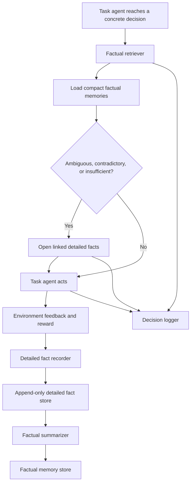
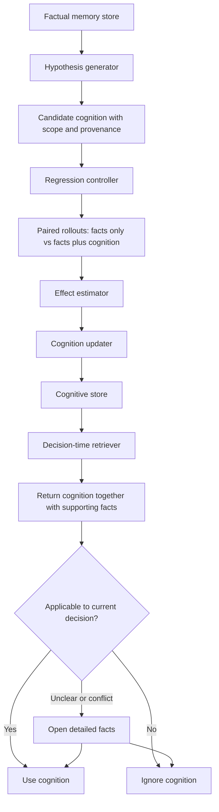

# Agentic Hierarchical Memory for LatentGym

## Implementation and Experiment Plan

**Status:** working design specification  
**Initial environment:** `number_guessing`  
**Primary objective:** first determine whether explicit factual memory improves cross-task performance, then test whether the system can continuously reconcile, correct, and maintain those facts before introducing cognitive memory or RL  
**Second objective:** add evidence-grounded cognitive memory with regression testing and decision-time applicability checks  
**Longer-term objective:** use the same environment and evaluation framework for RL-managed memory and, later, latent or differentiable memory architectures

**Implementation progress (LatentGym notes):**

| Plan unit | Note file | Status |
|---|---|---|
| Phase 0 | `AGENTIC_MEMORY_PHASE0_NOTE.md` | Done |
| Pilot 1 / eng. Phase 1 (factual utility) | `AGENTIC_MEMORY_PHASE1_NOTE.md` | Done on `range_100` / `traj_000` (7 ep, GPT-5.6) |
| Pilot 2 (flat extract + Hermes-pattern skills) | `AGENTIC_MEMORY_PHASE2_NOTE.md` | Done on same seed (not eng. Phase 2) |
| Pilot 3 / eng. **Phase 2** (fact reconciliation) | — | **Next** |
| Eng. Phase 3+ (retrieval scale, cognition, RL) | — | Not started |

Do not confuse **Pilot 2** (representation / skill baselines) with engineering **Phase 2** (reconciliation).

---

## 0. Instructions for Cursor

Before editing code:

1. Read the repository's top-level `README.md`.
2. Read `docs/getting_started.md`.
3. Read `latentgym/eval/README.md`, especially:
   - single-agent evaluation flow;
   - `APIRunner`;
   - `TrajectoryResult` and `EpisodeOutcome`;
   - saved trajectory and reporting formats.
4. Read `latentgym/envs/number_guessing/README.md` and the corresponding environment implementation.
5. Read:
   - `latentgym/eval/single_agent/api_runner.py`;
   - `latentgym/eval/types.py`;
   - `latentgym/eval/orchestrator.py`;
   - `latentgym/eval/model_interface.py`.
6. Locate the exact code path that detects an episode boundary inside a multi-episode trajectory.
7. Determine how the standard runner retains earlier messages across episodes.
8. Do **not** modify the original runner until the baseline evaluation has been reproduced.
9. Implement memory functionality in isolated files and preserve existing APIs wherever possible.
10. Do **not** begin cognitive-memory generation or RL before the factual-memory baselines run end to end.
11. Never expose hidden `ground_truth`, latent values, or future episode configurations to the task agent, recorder, summarizer, retriever, or cognition generator. Hidden information may be used only by the evaluator.

The repository documentation may still refer to an older working-directory name such as `meta-rl`. Use the actual cloned repository root as the working directory.

---

## 1. Research Motivation

LatentGym evaluates whether an agent can improve across a sequence of tasks sharing a hidden latent structure. In the standard single-agent setup, the agent can use the accumulated interaction context.

This project asks whether a more explicit and auditable memory system can replace or improve on raw full-history context.

### Scope: interaction memory rather than Agent Wiki

This project studies memory accumulated from an agent's own interactions:
observations, actions, environment feedback, outcomes, failures, and later
inferred cognition.

It is distinct from an **Agent Wiki**, which compiles a relatively stable
document collection into topic-oriented pages for shared knowledge access.
Agent Wikis are organized primarily around documents and topics, whereas this
project is organized around trajectories, decisions, and agent-visible
evidence.

The two paradigms nevertheless share several useful engineering principles:

- perform expensive structuring work at ingestion time rather than repeating it
  from scratch for every query;
- persist derived representations rather than treating every interaction as
  disposable context;
- retain provenance links from compact representations back to original
  evidence;
- use selective fallback to original evidence when a compiled representation
  is incomplete, ambiguous, stale, or contradictory.

The target here belongs to the **interaction-memory** side of that distinction.
Mem0 is therefore relevant as an end-to-end interaction-memory system, not as
evidence that an Agent Wiki and an agent's personal or trajectory-bound memory
are the same object.

The staged memory lifecycle is:

```text
interaction trajectory
    -> detailed factual record
    -> atomic claims with time, scope, and provenance
    -> fact reconciliation and current factual view
    -> compact factual memory linked to the detailed record
    -> decision-time retrieval
    -> optional drill-down when the summary is ambiguous or contradictory
    -> later: candidate cognitive memory grounded in facts
    -> regression validation before broad adoption
    -> decision-time applicability check using the supporting facts
```

The central safety principle is:

> Memory may be useless, but it should not be toxic.

A second principle governs routine maintenance:

> Maintenance compute should primarily clarify and reconcile facts, not prematurely construct durable beliefs.

In this document, **fact** and **knowledge** are not treated as mutually exclusive
philosophical categories. A verified statement such as “Episode 3 target was
250” may reasonably be called both factual knowledge and a fact. The operational
distinction is instead between:

- **source-grounded factual state** — what was observed, when, under what scope,
  and from which evidence;
- **derived belief or strategy** — an interpretation, generalization, causal
  explanation, prediction, or recommendation inferred from those facts.

The project therefore treats a Wiki-style structured representation as safe
only when it has an explicit mechanism to detect duplicates, preserve temporal
and scope qualifiers, represent conflicts, issue corrections, and rebuild the
current factual view from provenance. Continuous refresh alone is insufficient
if it merely rewrites summaries without reconciling the underlying claims.

The core distinction is:

- **detailed factual memory** preserves the original evidence;
- **factual memory** is a compact, objective index over that evidence;
- **cognitive memory** is a fallible rule, belief, or strategy inferred from facts.

A cognitive rule is a shortcut, not a replacement for evidence. Even a cognition that passed regression tests must remain linked to the facts that justified it, so the agent can reconsider it when the current context differs or when memories conflict.

### Ingestion-time compilation and reversible access to evidence

A compact factual memory is an **ingestion-time compilation** of interaction
evidence. Like any precompiled knowledge representation, it may omit details
that later become decision-relevant. Therefore, compact memory must never
replace its source evidence.

The intended trade-off is:

```text
cheap, structured default representation
    + explicit provenance
    + on-demand access to original visible evidence
```

This makes provenance serve two purposes:

1. **auditability** — every memory can be checked against what the agent
   actually observed;
2. **recovery from lossy compression** — when a summary has dropped a detail
   needed for the current decision, the system can drill down rather than
   treating the summary as the complete truth.

An incorrect or stale compact memory can be more harmful than having no compact
memory at all because its structured form may be treated as authoritative.
Therefore, the project must measure not only average utility but also ambiguity,
contradiction, staleness, and memory-induced harm.

### Two separate validation points

The design deliberately keeps two forms of validation:

1. **Formation-time regression validation**
   - asks whether a candidate cognition tends to improve downstream decisions within a tested scope;
   - prevents arbitrary LLM-generated experience from becoming a trusted rule.

2. **Invocation-time applicability judgment**
   - asks whether that cognition applies to the concrete decision currently being made;
   - compares the current context with supporting facts and scope;
   - drills down into detailed facts when summaries are ambiguous or evidence conflicts.

These are complementary. Passing a regression suite does not make a cognition universally correct.


### Storage assumption and near-term priority

Persistent disk capacity is **not** treated as the primary bottleneck. The system should prefer retaining evidence over making irreversible deletion decisions.

Operational assumptions:

- factual records and their source evidence are append-only and retained on durable storage;
- physical deletion is out of scope for the initial experiments and the first RL formulation;
- correction, invalidation, and forgetting are metadata operations such as `corrected`, `obsolete`, `stale`, `retracted`, `cold`, or lower presentation priority;
- no provenance record is silently destroyed;
- compact factual memories are decision-oriented representations of evidence, not replacements created to save disk space.

However, **large-scale retrieval is not the first research problem**. The current bottleneck is that even a few memory files or a small number of records may be poorly structured, hard to interpret, or unhelpful to the task agent. The initial priority order is:

```text
1. Decide what deserves to be stored as a fact.
2. Decide what belongs in the core factual record versus supporting detail.
3. Test whether a small factual memory set improves behavior when all facts are shown.
4. Add fact reconciliation: identity, duplicate, conflict, correction, temporal scope, and current-status maintenance.
5. Add provenance-based drill-down when summaries are ambiguous or reconciliation is uncertain.
6. Only after scale becomes an observed problem, study ranking, top-k retrieval, and budgets.
```

Therefore:

- the first factual-memory prototype may use a **single factual layer**;
- when the store is small, the runner should present all factual memories rather than prematurely introducing a learned or heuristic top-k retriever;
- a two-level factual hierarchy—core factual memory plus detailed supporting evidence—should be introduced only when it clarifies the representation or resolves ambiguity;
- retrieval/context budgets remain a later systems problem, not a requirement for proving initial memory utility.

Long term, context-window bandwidth, latency, tool calls, and attention are still scarce even when disk is abundant. At that point the routing problem becomes:

```text
Given a retained archive, which facts should be surfaced for this concrete decision,
and when should the agent inspect their detailed evidence?
```

Storage size may be reported for engineering completeness, but neither disk usage nor permanent deletion should drive the initial objective or reward.

### Cost accounting

Moving work from query time to ingestion time does not eliminate cost. It
redistributes cost across the memory lifecycle. Report at least three categories
separately:

1. **Construction cost**
   - recording;
   - extraction;
   - factual summarization;
   - cognition generation;
   - token and model-call cost incurred when memory is created.

2. **Maintenance cost**
   - provenance validation;
   - duplicate and contradiction detection;
   - status revision;
   - rebuilding compact memories or cognition after new evidence;
   - periodic scans for stale or unsupported content.

3. **Invocation cost**
   - retrieval and ranking calls;
   - memory tokens inserted into the task context;
   - detailed-fact drill-down calls;
   - latency and task-agent attention consumed at decision time.

This decomposition prevents a misleading conclusion in which a method appears
cheap only because expensive work has been shifted from decision time to memory
construction or maintenance. It also exposes unused precomputed memories as
possible sunk cost without assuming that they should be physically deleted.

---

## 2. Main Research Questions

The experiments should be staged. Do not require the cognitive layer to answer the first questions.

### Stage A: factual memory

#### RQ1: Does a small factual memory set improve over no cross-task memory?

Compare:

- no cross-task memory;
- all factual memories accumulated so far.

The first test should avoid retrieval ranking. Its purpose is to determine whether the **content and representation** of factual memory are useful at all.

#### RQ2: What belongs in a factual memory?

Compare factual representations such as:

- episode outcome only;
- context + action + outcome;
- failures and surprising outcomes only;
- all externally verified events;
- one unified factual record versus a compact core fact linked to supporting detail.

This question precedes optimization of retrieval priority.

#### RQ3: Can factual memory replace raw full history?

Compare:

- full interaction history;
- a small read-all factual-memory set.

Report token usage, but do not impose a tight matched budget in the first pilot.

#### RQ4: Does hierarchical drill-down improve factual memory?

After the single-layer factual baseline is understood, compare:

- factual records without a separate detail layer;
- compact core facts linked to detailed records;
- compact facts with on-demand drill-down when the agent detects ambiguity, contradiction, or insufficient evidence.

Measure whether the additional hierarchy improves robustness and interpretability enough to justify its complexity.

#### RQ5: Can the system maintain a coherent factual state as evidence accumulates?

This question goes beyond extracting or displaying facts. Test whether the
memory system can distinguish:

- duplicate reports of the same event from repeated occurrences of similar events;
- apparent conflicts caused by different times, scopes, or entities from genuine contradictions;
- corrections from ordinary new observations;
- superseded state claims from immutable historical event claims;
- directly observed facts from deterministic aggregates and uncertain inferences.

The target output is not one irreversible summary. It is an append-only evidence
archive plus a maintained **current factual view** whose claims have explicit
status, temporal scope, provenance, and relations to other claims.

#### RQ6: Does fact reconciliation reduce memory-induced harm?

Compare:

- append-only extracted facts with no reconciliation;
- facts with duplicate linking only;
- facts with duplicate, conflict, correction, and supersession relations;
- reconciled facts with provenance-based drill-down for unresolved cases.

Measure whether reconciliation improves task performance, factual consistency,
auditability, and recovery after deliberately injected noisy or conflicting
records.

### Stage B: cognitive memory

#### RQ7: Does cognitive memory add value beyond its supporting facts?

Under identical factual evidence, compare:

- facts only;
- cognition only;
- facts plus cognition.

This comparison directly tests the concern that skill-like systems may rely on distilled experience while discarding the evidence required to question it.

#### RQ8: Does regression validation reduce toxic cognitive memory?

Compare:

- naive LLM-generated cognition accepted immediately;
- evidence-gated cognition with scope and provenance;
- regression-validated cognition;
- regression-validated cognition plus invocation-time fact checking.

#### RQ9: Which failures dominate?

Separate at least:

- detailed-recording failure;
- factual summarization failure;
- retrieval failure;
- failure to drill down when needed;
- overgeneralized cognition;
- incorrect scope;
- memory-utilization failure;
- stale cognition after latent drift;
- context pollution from irrelevant facts;
- toxic cognition overriding contradictory facts.

### Stage C: learned memory policy

#### RQ10: Which decisions should eventually be learned by RL?

Do not assume the answer in advance. Use the agentic system to determine whether the main bottleneck is:

- selecting factual summaries;
- deciding when to open detailed records;
- generating candidate cognitions;
- promoting, rejecting, or revising cognition;
- deciding whether to use a cognition for the current decision;
- de-prioritizing, marking stale, or invalidating cognition without deleting its evidence;
- selecting regression tests.

---

## 3. Memory Hierarchy and Provenance Graph

The conceptual target has three memory levels. A stable identity or soul layer may exist in a production assistant, but it is fixed and out of scope for the first LatentGym experiments.

The implementation should **not require all three levels on day one**:

- v0 may use one factual record containing the core event plus references to its visible source;
- v1 may split that record into a compact core fact and detailed supporting evidence;
- cognitive memory is added only after factual-memory utility is understood.

This lets the project first answer what the factual-memory body should contain before adding retrieval and hierarchy machinery.

### 3.1 Detailed factual memory

Detailed facts preserve the evidence with minimal transformation.

Examples include:

- the original messages in an episode;
- each guess and higher/lower response;
- the exact environment feedback visible to the agent;
- tool output, error text, or user wording in later environments;
- references to the original trajectory and message indices.

A detailed fact should be immutable as an audit record. Corrections are represented by new records or metadata, not silent rewriting.

Example:

```json
{
  "detailed_fact_id": "df_ep3",
  "trajectory_id": "traj_0001",
  "episode_idx": 3,
  "visible_messages": [
    {"role": "assistant", "content": "500"},
    {"role": "environment", "content": "The target is lower."},
    {"role": "assistant", "content": "250"},
    {"role": "environment", "content": "Correct. The target was 250."}
  ],
  "source_type": "agent_visible_transcript"
}
```

### 3.2 Factual memory

Factual memory is a compact, objective summary linked to one or more detailed records.

Its canonical form is:

```text
context + action + observed outcome + source references
```

Facts must not introduce causal explanations, general rules, or advice.

Valid factual memory:

```text
Episode 3; first guess was 500; feedback said lower; the revealed target was 250.
```

Invalid factual memory:

```text
The agent should start below 500 because targets in this session are usually small.
```

The invalid statement belongs in the cognitive layer.

Factual memories may be somewhat compressed or incomplete. When the summary is ambiguous, surprising, contradictory, or high impact, the agent can follow the link to detailed facts.

### 3.3 Cognitive memory

Cognitive memory contains reusable beliefs, strategies, or rules inferred from factual memories.

Every cognitive memory must contain:

- `claim`: what the system currently believes;
- `scope`: conditions under which the claim was tested or observed;
- `action_implication`: how it may change a decision;
- `supporting_fact_ids`: links to compact factual memories;
- `counterevidence_fact_ids`: known conflicting facts;
- `validation_runs`: formation-time regression results;
- `status`: candidate, tentative, validated, revised, rejected, or stale;
- `confidence`: evidence-based support, not LLM self-confidence.

A cognition must not claim validity beyond its tested scope.

### 3.4 Tree-like structure, implemented as a DAG

Conceptually:

```text
cognitive memory
    -> supporting factual memories
        -> detailed factual records
            -> original visible sources
```

In implementation, use IDs and references rather than a strict tree. The structure is usually a DAG because:

- one factual memory may support several cognitions;
- one cognition may depend on several facts;
- one detailed record may generate several factual summaries.

### 3.5 Provenance invariant

Every decision and memory must support this trace:

```text
decision
    -> loaded cognition IDs and factual-memory IDs
    -> supporting factual-memory IDs
    -> detailed-fact IDs
    -> original agent-visible source messages
```

The system should fail loudly when a reference is missing.

---

## 4. Staged Agentic Architecture

### 4.0 Stage A0: minimal single-layer factual memory

The first executable memory system may be deliberately simple:

```text
Task agent completes an episode
        -> deterministic recorder writes one factual record
        -> record includes context, action, outcome, and source references
        -> next episode receives all factual records accumulated so far
```

No ranking, top-k retrieval, drill-down policy, cognition, or RL is required. This stage tests whether the chosen factual representation changes downstream behavior.

### 4.1 Stage A1: two-level factual-memory architecture



### 4.2 Stage B: add cognitive memory



### 4.3 Components

1. **Task agent**
   - Existing LatentGym model interface.
   - Solves the game.
   - Model parameters remain frozen in the initial agentic experiments.

2. **Detailed fact recorder**
   - Saves agent-visible trajectory fragments with exact source references.
   - Uses no LLM in Number Guessing v0.

3. **Detailed fact store**
   - Append-only JSON or JSONL for v0.
   - Supports lookup by detailed-fact ID.

4. **Factual summarizer**
   - Produces compact objective records from detailed facts.
   - Deterministic in Number Guessing v0.
   - Later environments may use a constrained LLM call.

5. **Factual memory store**
   - Stores compact facts and links to detailed records.
   - Supports decision-conditioned retrieval.

6. **Drill-down controller**
   - Allows the task agent or deterministic policy to open detailed records.
   - Triggers may include conflict, ambiguity, low confidence, or high-risk decisions.

7. **Decision logger**
   - Records what was retrieved, what was opened, what the model cited, the action, and the outcome.

8. **Hypothesis generator**
   - Added only after factual-memory experiments are stable.
   - Proposes structured, falsifiable candidate cognitions from factual memories.
   - Does not validate its own output.

9. **Regression controller**
   - Ordinary deterministic code.
   - Forks or replays a common prefix into paired suffix rollouts.
   - Tests candidate cognition while holding factual evidence fixed.

10. **Effect estimator**
    - Computes paired downstream effects and harm.

11. **Cognitive store / updater**
    - Stores cognition with tested scope, provenance, and status.
    - Revises scope rather than treating every counterexample as global rejection.

12. **Decision-time cognition checker**
    - Evaluates current applicability.
    - Returns supporting facts with cognition.
    - Opens detailed records when facts and cognition conflict.

---

## 5. Initial Number Guessing Instantiation

Assume a latent such as a recurring target set:

```text
z = {137, 793}
```

A trajectory contains multiple episodes whose targets are sampled from the same latent.

### 5.1 Detailed factual record

```json
{
  "detailed_fact_id": "df_ep0",
  "trajectory_id": "traj_0001",
  "episode_idx": 0,
  "message_refs": [0, 1, 2, 3],
  "visible_transcript": [
    "Agent guessed 500",
    "Environment: lower",
    "Agent guessed 137",
    "Environment: correct; target was 137"
  ],
  "source_type": "agent_visible_transcript"
}
```

### 5.2 Compact factual memory

```json
{
  "fact_id": "f_ep0_outcome",
  "trajectory_id": "traj_0001",
  "episode_idx": 0,
  "context": {
    "environment": "number_guessing",
    "latent_session": "traj_0001",
    "decision_type": "episode_outcome"
  },
  "action": "final guess 137",
  "outcome": "correct target was 137",
  "detailed_fact_ids": ["df_ep0"],
  "verified": true
}
```

After several episodes, the factual memory presented to the agent may be:

```text
Verified records from this trajectory:
- Episode 1 target was 137.
- Episode 2 target was 793.
- Episode 3 target was 137.
```

No rule is asserted yet.

### 5.3 Candidate cognition, added later

```json
{
  "cognition_id": "h1",
  "claim": "Targets may recur from the set of previously observed target values.",
  "scope": {
    "environment": "number_guessing",
    "latent_session": "current trajectory before reset or detected drift"
  },
  "action_implication": "Try previously observed targets before restarting binary search.",
  "supporting_fact_ids": ["f_ep0_outcome", "f_ep1_outcome", "f_ep2_outcome"],
  "counterevidence_fact_ids": [],
  "status": "candidate"
}
```

An **optional** handwritten toxic cognition (diagnostic only; not required for the default harm baseline) is:

```json
{
  "cognition_id": "h2",
  "claim": "Targets alternate deterministically between the two most recently observed values.",
  "scope": {
    "environment": "number_guessing",
    "latent_session": "current trajectory"
  },
  "action_implication": "Guess the value different from the previous target first.",
  "supporting_fact_ids": ["f_ep0_outcome", "f_ep1_outcome", "f_ep2_outcome"],
  "counterevidence_fact_ids": [],
  "status": "candidate"
}
```

Default harm evidence instead comes from **LLM-distilled skills** that overgeneralize or negate useful session structure (see Pilot 2 `skill_only_llm`).

### 5.4 Invocation-time conflict example

Suppose `h2` (or an equivalently wrong distilled lesson) passed a small early test, but the factual store later contains:

```text
Episode 4 target was 137.
Episode 5 target was also 137.
```

At the next decision, the system should not present `h2` alone. It should return the conflicting facts and allow the agent to inspect the detailed episodes. The likely update is to reject or narrow `h2`, not to ignore the evidence because the rule was previously validated.

---

## 6. Data Schemas

Use dataclasses or Pydantic models, following repository conventions.

### 6.1 `DetailedFact`

```python
@dataclass
class DetailedFact:
    detailed_fact_id: str
    trajectory_id: str
    episode_idx: int
    decision_idx: int | None
    source_type: str
    source_refs: list[dict[str, Any]]
    visible_content: list[dict[str, Any]]
    created_at: str
    metadata: dict[str, Any]
```

### 6.2 `FactualMemory`

```python
@dataclass
class FactualMemory:
    fact_id: str
    trajectory_id: str
    episode_idx: int
    decision_idx: int | None
    context: dict[str, Any]
    action: str | None
    outcome: str
    detailed_fact_ids: list[str]
    verified: bool
    created_at: str
    status: str  # active, corrected, obsolete, archived
```

### 6.3 `FactClaim` and reconciliation relations

The existing `FactualMemory` object is sufficient for the first read-all
baseline, but Phase 2 should separate an event record from the claims maintained
about it.

```python
@dataclass
class FactClaim:
    claim_id: str
    subject_key: str
    predicate: str
    object_value: Any
    valid_time_start: str | None
    valid_time_end: str | None
    observed_at: str
    scope: dict[str, Any]
    source_detailed_fact_ids: list[str]
    derivation_type: str  # observed, deterministic_aggregate, inferred
    verification_status: str  # verified, disputed, unresolved, retracted
    current_status: str  # active, superseded, corrected, historical
    confidence: float | None
```

```python
@dataclass
class FactRelation:
    relation_id: str
    source_claim_id: str
    target_claim_id: str
    relation_type: str  # duplicate_of, same_value_new_event, contradicts,
                        # corrects, supersedes, refines, supports
    rationale: str
    evidence_ids: list[str]
    created_at: str
```

The system must not collapse two claims merely because their surface text or
values match. For example, “Episode 1 target was 137” and “Episode 3 target was
137” are two historical events with the same value, not duplicate records.

### 6.4 `CurrentFactView`

```python
@dataclass
class CurrentFactView:
    view_id: str
    entity_or_scope_key: str
    active_claim_ids: list[str]
    disputed_claim_ids: list[str]
    historical_claim_ids: list[str]
    unresolved_relation_ids: list[str]
    built_from_store_version: str
    built_at: str
```

The current view is rebuildable from the append-only claims, relations, and
source evidence. It is never the only surviving representation.

### 6.5 `CognitiveMemory`

```python
@dataclass
class CognitiveMemory:
    cognition_id: str
    claim: str
    scope: dict[str, Any]
    action_implication: str
    supporting_fact_ids: list[str]
    counterevidence_fact_ids: list[str]
    falsification_condition: str
    status: str
    confidence: float | None
    validation_run_ids: list[str]
    revision_parent_id: str | None
```

### 6.6 `DecisionTrace`

A decision trace must preserve both the task decision and the memory decision that preceded it. It must record the full candidate set available at that moment, not only the memories eventually selected.

```python
@dataclass
class DecisionTrace:
    decision_id: str
    trajectory_id: str
    episode_idx: int
    decision_idx: int
    decision_type: str

    # Concrete state at the moment memory could affect behavior.
    current_context: dict[str, Any]
    memory_query: str | None

    # The choice set visible to the memory policy.
    available_fact_ids: list[str]
    available_detailed_fact_ids: list[str]
    available_cognition_ids: list[str]

    # Memory actions actually taken.
    loaded_fact_ids: list[str]
    opened_detailed_fact_ids: list[str]
    loaded_cognition_ids: list[str]
    memory_action: dict[str, Any]
    rendered_memory_text: str

    # Task-agent behavior after conditioning on memory.
    task_action: str
    cited_or_claimed_used_memory_ids: list[str]
    action_changed_after_drilldown: bool | None

    # Outcomes and delayed returns.
    immediate_reward: float | None
    suffix_reward: float | None
    sequence_reward: float | None
    outcome: dict[str, Any]

    # Costs and counterfactual grouping.
    memory_token_count: int
    retrieval_call_count: int
    detailed_fact_call_count: int
    counterfactual_group_id: str | None
    branch_id: str | None

    # Reproducibility.
    model_id: str
    model_sampling_config: dict[str, Any]
    prompt_version: str
    code_commit: str
```

The field `cited_or_claimed_used_memory_ids` is weak evidence because an LLM may misreport what influenced it. Preserve it, but also compare behavior across paired branches to measure whether memory actually changed the action.

### 6.7 `MemoryActionTrace`

Use a separate normalized record when training a router independently from the task agent.

```python
@dataclass
class MemoryActionTrace:
    memory_decision_id: str
    decision_trace_id: str
    policy_state: dict[str, Any]
    candidate_memory_ids: list[str]
    chosen_action: dict[str, Any]
    chosen_memory_ids: list[str]
    rejected_or_unselected_memory_ids: list[str]
    action_logprob: float | None
    policy_version: str
    downstream_suffix_reward: float | None
    paired_marginal_reward: float | None
    harm_amount: float | None
```

Logging unselected candidates is mandatory. Without the choice set, later training can imitate successful selections but cannot learn why one fact should be preferred over another.

### 6.8 `CounterfactualBranchRun`

This generic schema supports factual retrieval, drill-down, and cognition experiments.

```python
@dataclass
class CounterfactualBranchRun:
    counterfactual_group_id: str
    branch_id: str
    source_trajectory_id: str
    fork_episode_idx: int
    prefix_snapshot_id: str
    suffix_episode_indices: list[int]
    memory_action: dict[str, Any]
    selected_memory_ids: list[str]
    seed: int
    episode_rewards: list[float]
    episode_turns: list[int]
    first_guess_correct: list[bool]
    suffix_reward: float
    sequence_reward: float
    memory_token_count: int
    retrieval_call_count: int
    detailed_fact_call_count: int
    failure_tags: list[str]
```

Branches in the same `counterfactual_group_id` must share the same prefix, latent, suffix tasks, task-agent configuration, and sampling setup as closely as the environment permits. Only the memory action should differ.

### 6.9 `RegressionRun`

Cognitive regression tests may retain a cognition-specific view over the generic branch records.

```python
@dataclass
class RegressionRun:
    run_id: str
    counterfactual_group_id: str
    cognition_id: str
    source_trajectory_id: str
    fork_episode_idx: int
    suffix_episode_indices: list[int]
    condition: str  # facts_only or facts_plus_cognition
    seed: int
    episode_rewards: list[float]
    episode_turns: list[int]
    first_guess_correct: list[bool]
    suffix_reward: float
    paired_effect: float | None
    memory_token_count: int
    failure_tags: list[str]
```

### 6.10 Reference and visibility validation

Add checks enforcing:

```text
cognition -> valid factual-memory IDs
factual memory -> valid detailed-fact IDs
decision trace -> valid candidate and loaded-memory IDs
counterfactual branches -> identical prefix and suffix configuration
all memory content -> agent-visible sources only
```

Provenance is a hard schema constraint, not a soft reward bonus. A memory action with missing or invalid source references should be rejected rather than rewarded less.

---

## 7. Detailed Recording and Factual Summarization

### 7.0 What deserves to be stored

The first design question is semantic usefulness, not disk conservation. Treat fact-writing policy as an explicit experimental variable.

Strong candidates for factual storage include:

- explicit user statements or environment feedback;
- externally verified outcomes;
- failed actions and their observed results;
- surprising outcomes that contradict the agent's expectation;
- actions with irreversible, costly, or high-impact consequences;
- context needed to interpret why two superficially similar events differ.

Weak candidates include:

- duplicated restatements;
- routine intermediate steps with no later decision value;
- unsupported model speculation presented as fact;
- evaluator-only information the agent could not observe.

The distinction is not “store little because disk is scarce.” It is “store records whose factual body remains interpretable and potentially decision-relevant.” The source transcript may still be retained for provenance even when an event is not promoted into the default factual-memory presentation.

Initial writing-policy ablations should include:

1. all externally verified episode outcomes;
2. context + action + outcome for every episode;
3. failures and surprising outcomes only;
4. a hybrid policy that always stores explicit outcomes and selectively stores informative action details.

### 7.1 Number Guessing v0: deterministic implementation

Do not use an LLM when the required information is already available in agent-visible feedback.

Record:

- guesses made;
- higher/lower feedback;
- whether the episode was solved;
- target revealed through configured inter-episode feedback;
- number of turns;
- exact visible message references.

Never read evaluator-only fields for the memory pipeline.

### 7.2 Factual-summary constraints

A factual summary must:

- state the context;
- state the action, if relevant;
- state the observed outcome;
- retain links to detailed evidence;
- avoid causes, advice, preferences, or general rules not explicitly stated by the source.

For later environments, use a constrained prompt:

```text
Summarize only factual events explicitly supported by the supplied record.
For each fact return:
- context;
- action;
- observed outcome;
- detailed-record IDs;
- whether the outcome was environment-verified.

Do not infer causes, preferences, rules, advice, or future strategy.
Do not use because, therefore, should, always, generally, or likely unless quoting a source and marking it as a quote.
Return valid JSON only.
```

### 7.3 Detailed drill-down

The first implementation may use a simple rule:

Open a detailed fact when at least one condition holds:

- two retrieved factual summaries appear inconsistent;
- a summary omits information needed for the current decision;
- a retrieved cognition conflicts with a fact;
- the task agent explicitly requests evidence;
- the action is designated high risk;
- the factual summary was generated with low confidence.

For Number Guessing, first implement an explicit tool-like call:

```text
OPEN_DETAILED_FACT <fact_id>
```

The runner resolves the fact ID and returns only the linked agent-visible record.

---

## 8. Fact Reconciliation and Ongoing Maintenance

Fact extraction answers “what candidate facts can be written?” Fact
reconciliation answers “how should multiple claims coexist after new evidence
arrives?” This is the main addition required to move from merely recording facts
to **clarifying facts**.

### 8.1 Reconciliation operations

At each episode boundary or maintenance pass:

1. parse new evidence into source-grounded claims;
2. identify the entity, event, time, and scope of each claim;
3. compare each new claim with potentially related existing claims;
4. classify the relation as:
   - same event / duplicate report;
   - same value but different event;
   - compatible under different times or scopes;
   - refinement;
   - correction;
   - supersession;
   - genuine unresolved contradiction;
5. preserve all source records and add relation metadata;
6. rebuild the current factual view;
7. surface unresolved cases for drill-down rather than inventing a resolution.

### 8.2 Three factual categories

Every maintained claim should be labeled as one of:

1. **Observed event fact**
   - directly supported by an agent-visible event;
   - example: “Episode 3 revealed target 137.”

2. **Deterministic derived fact**
   - mechanically computed from observed events;
   - example: “137 has appeared twice in Episodes 1–3.”
   - the derivation function and source claim IDs must be recorded.

3. **Hypothesis or belief**
   - not guaranteed by the observations;
   - example: “The next target will probably be 137.”
   - this must not enter the factual layer.

### 8.3 Controlled reconciliation cases

The initial test suite should include:

- duplicated transcript or repeated extraction of the same event;
- identical values arising in different episodes;
- two incompatible target values attributed to the same episode;
- state changes that make an older claim historical rather than false;
- claims that become compatible after adding time or scope qualifiers;
- noisy LLM extraction that omits a qualifier;
- a later correction from a higher-reliability source;
- unresolved conflicts where neither source is authoritative.

### 8.4 Deterministic first implementation

For Number Guessing, reconciliation should initially be deterministic:

- episode identity is defined by `trajectory_id + episode_idx`;
- target claims for different episodes are separate events even when values match;
- incompatible target claims for the same episode are contradictions;
- an environment-verified revealed target outranks an unverified extracted guess;
- no conflicting record is deleted;
- the active view selects the verified claim and marks the other claim disputed or corrected;
- all decisions and status changes retain source IDs.

An LLM-based reconciliation agent may be added only after this deterministic
benchmark establishes expected behavior.

### 8.5 Reconciliation metrics

Report:

- duplicate-detection precision and recall;
- same-value-different-event false merge rate;
- contradiction-detection precision and recall;
- correction and supersession accuracy;
- temporal/scope qualification accuracy;
- unresolved-conflict rate;
- current-view factual accuracy;
- provenance completeness;
- task harm caused by unreconciled or incorrectly reconciled claims;
- construction and maintenance calls, tokens, latency, and rebuild cost.

## 9. Stage A: Factual-Memory Experiments

The first experiments should stop here. They do not require cognitive memory.

### 8.1 Conditions

Run the conditions incrementally rather than implementing the full hierarchy at once.

#### Initial minimum set

1. **No cross-task memory**
   - clear earlier episode context;
   - each episode begins without past records.

2. **Full history**
   - existing LatentGym single-agent behavior.

3. **Single-layer factual memory, read all**
   - remove raw prior dialogue;
   - provide every factual record accumulated so far;
   - use no ranking, top-k rule, or retrieval budget while the store is small.

#### Representation ablations

4. **Outcome-only facts**
   - store only externally verified episode outcomes.

5. **Context-action-outcome facts**
   - retain enough context and action detail to make the event interpretable.

6. **Selective fact writing**
   - compare all verified events with a policy that prioritizes explicit statements, failures, surprises, and high-impact outcomes.

#### Fact-maintenance ablations

7. **Append-only facts without reconciliation**
   - preserve every extracted fact independently;
   - provides the control for testing whether maintenance itself matters.

8. **Reconciled factual memory**
   - link duplicate reports;
   - distinguish repeated events from duplicate records;
   - mark contradiction, correction, refinement, and supersession relations;
   - present the maintained current factual view while preserving the archive.

9. **Reconciled facts plus unresolved-case drill-down**
   - open source evidence whenever deterministic reconciliation cannot safely resolve a conflict.

#### Later hierarchy experiments

10. **Detailed factual memory only**
   - provide raw linked records without compact summaries.

11. **Compact core facts plus detailed evidence**
   - provide all compact facts;
   - allow linked detailed records to be opened when needed.

12. **Budgeted retrieval**
   - add top-k, ranking, or context budgets only after the read-all factual baseline shows that memory content is useful and store size causes measurable interference or cost.

### 8.2 Baseline families and recommended comparison matrix

This section summarizes the baseline discussion for the first experiments. Hidden-state, hidden-state-embedding, and latent-vector memory baselines are deliberately excluded for now.

The goal is not to reimplement every external memory system end to end. For LatentGym, use controlled **system-pattern baselines** that isolate what information is retained and shown to the same task agent.

#### Family 0: context-only references

1. **No cross-task memory**
   - each episode starts without prior episode information;
   - measures the task agent's non-memory capability.

2. **Full history**
   - retain the original visible interaction transcript;
   - serves as a high-context reference rather than a storage-efficient method.

3. **Recent window or rolling summary** — optional after the minimum pilot
   - retain only the last `k` episodes, or one unconstrained running summary;
   - tests whether generic context compression is already sufficient without an explicit factual schema.

#### Family 1: fact-centric baselines

4. **Outcome-only factual memory**
   - retain only externally verified episode outcomes;
   - tests the smallest factual representation.

5. **Context-action-outcome factual memory**
   - retain the situation, action, and observed result;
   - tests whether facts need enough context to be reusable.

6. **Atomic fact representation baseline**
   - use an LLM prompt to extract short, flat, reusable facts from the agent-visible prefix;
   - deduplicate facts, but do not require context-action-outcome structure, a source tree, or a detailed-evidence layer;
   - keep it append-only and read all extracted facts in the small-memory experiment;
   - this is a representation ablation, not a faithful reproduction of Mem0.

7. **Provenance-grounded factual memory — proposed method, Stage A**
   - retain objective facts with stable source references;
   - initially read all facts;
   - later allow a compact fact to open its linked detailed record.

8. **Oracle factual summary**
   - construct the best concise factual memory from information that was genuinely visible to the agent;
   - never expose the hidden latent, future targets, or evaluator-only ground truth;
   - separates factual representation failure from the possibility that factual memory is not useful.

#### Family 2: experience- or skill-centric baselines

9. **Naive reflection / lesson summary**
   - after each episode or prefix, ask an LLM what lesson should be carried forward;
   - retain the lesson without an explicit factual evidence bundle;
   - tests a minimal experience-memory baseline.

10. **Hermes-style experience or skill only**
    - generate reusable procedural advice, strategies, or lessons from prior interactions;
    - show the skill to the task agent without separately showing the factual episodes that produced it;
    - tests the manager's concern that an experience-only system may be useful in-distribution but brittle when the current context conflicts with the learned lesson.

11. **Hermes-style facts plus experience / skills**
    - provide both concise factual records and the reusable skill or lesson derived from them;
    - tests whether retaining evidence improves the safe use of experience.

The Hermes labels refer to the system pattern of persistent memory plus skills and an experience-driven learning loop, not necessarily a full reproduction of every Hermes Agent subsystem.

**How Hermes-style skills are produced (important):**

- In the real Hermes Agent product, skills are primarily **agent-distilled**: after tasks, the agent writes or revises procedural `SKILL.md`-like artifacts (humans may also author or approve skills).
- In LatentGym Pilot 2, use the same *information pattern* (skill without facts vs facts plus skill) under a transparent adaptation (landed; see `AGENTIC_MEMORY_PHASE2_NOTE.md`):
  1. **Proxy skill:** deterministic experimenter template from agent-visible outcomes — plumbing / lower bound, **not** Hermes distillation (`skill_only`, `facts_plus_skill`).
  2. **Closer Hermes-pattern adaptation:** after each episode, prompt an LLM to write a short lesson from agent-visible outcomes, then inject alone (`skill_only_llm`) or with dense facts (`facts_plus_skill_llm`). No `SKILL.md` / Hermes product integration.
- **Harm / brittleness baseline:** do **not** require handwritten “toxic cognition” injects. Prefer market-style LLM distillation; on the pilot seed, `skill_only_llm` underperformed dense facts and sometimes advised against using shared-range structure. Handwritten toxic rules remain optional diagnostics only.
- Do not report a template or LatentGym distilled skill as “Hermes Agent.” Label as Hermes-**pattern** adaptation.

The atomic flat-fact baseline (`atomic_flat_llm`) is framework-independent and **landed in Pilot 2** (read-all LLM notes). A **faithful Mem0 system baseline** (query top-k / hybrid) remains deferred until retrieval scale becomes relevant.

Mem0 should be treated primarily as an **interaction-memory baseline**:

```text
conversation or trajectory
    -> agentic extraction of reusable memory
    -> persistent user- or session-bound memory store
    -> query-conditioned retrieval
```

It should not be conflated with an Agent Wiki, whose primary input is a document
collection and whose organization is topic- or document-centric. The later
Mem0 comparison is useful because both Mem0 and this project make agent-visible
interaction history persistent; the research difference should be isolated in
representation, provenance, drill-down, hierarchy, and retrieval behavior
rather than asserted from terminology alone.

Official project references:

- [Hermes Agent documentation](https://hermes-agent.nousresearch.com/docs/)
- [Mem0: How It Works](https://docs.mem0.ai/core-concepts/how-it-works)

#### Family 3: provenance and hierarchy ablations

12. **Compact facts without drill-down**
    - expose only concise factual records.

13. **Compact facts plus always-open details**
    - expose both summaries and their detailed evidence;
    - provides an upper-cost reference for the detail layer.

14. **Compact facts plus selective drill-down**
    - show concise facts first;
    - allow the agent to open detailed evidence only when ambiguity, contradiction, or low confidence is detected.

Cognitive-memory variants remain a later Stage B comparison and should not block the factual baseline study.

#### What each key comparison isolates

| Comparison | Primary question |
|---|---|
| No memory vs. full history | Is cross-task information useful at all? |
| Full history vs. factual memory | Can structured facts replace raw transcript context? |
| Outcome-only vs. context-action-outcome | What factual granularity is necessary? |
| Atomic flat facts vs. provenance-grounded event facts | Do context-action-outcome structure and explicit source grounding add value beyond flat fact extraction? |
| Skill only vs. facts only | Is generalized experience more useful than retaining events? |
| Skill only vs. facts plus skill | Do supporting facts reduce brittle or toxic skill use? |
| Compact facts vs. compact facts plus drill-down | Does access to original evidence help under ambiguity or conflict? |
| Append-only facts vs. reconciled facts | Does duplicate/conflict/correction maintenance improve factual accuracy and reduce harm? |
| Proposed facts vs. oracle facts | Is the bottleneck extraction quality or memory utility? |

#### Recommended experiment order

Do not run every baseline in the first sweep.

**Number Guessing defaults for these pilots**

- horizon: use the environment default of **7 episodes** (do not use a shortened 5-episode debug horizon once reporting Stage A results);
- primary latent after smoke tests: **`range_100`** with `feedback=standard` (enough headroom that memory helps but does not trivially 1-shot);
- optional smoke latent: `set_of_2` with `feedback=information` only to verify plumbing;
- model for real-API pilots: a strong fixed task agent (currently GPT-5.6 via LLMCenter);
- Stage A0 presentation: **read-all** prior-episode facts unless a later phase demonstrates interference.

**Pilot 1: establish factual-memory utility** — **done** (see `AGENTIC_MEMORY_PHASE1_NOTE.md`)

1. no memory;
2. full history;
3. outcome-only facts;
4. context-action-outcome facts;
5. oracle factual summary.

**Pilot 2: compare factual representations and experience paradigms** — **done** on `traj_000` (see `AGENTIC_MEMORY_PHASE2_NOTE.md`)

6. atomic flat facts, read-all (`atomic_flat_llm`);
7. provenance-grounded / dense event facts, read-all (`episodic_only` from Pilot 1);
8. Hermes-pattern skill only (template + `skill_only_llm`);
9. facts plus the same skill (`facts_plus_skill` / `facts_plus_skill_llm`).

A faithful Mem0 system comparison is not part of this pilot. Add it later only when memory volume makes query-based retrieval meaningful.

**Pilot 3: test fact reconciliation and why provenance matters** — **next** (engineering Phase 2)

10. append-only facts without reconciliation;
11. reconciled facts with deterministic duplicate/conflict/correction handling;
12. reconciled facts plus unresolved-case drill-down;
13. compact facts without details;
14. compact facts plus always-open details;
15. compact facts plus selective drill-down;
16. conflict, ambiguity, noise, correction, and latent-drift cases.

Number Guessing rarely produces natural claim conflicts under clean deterministic extraction; Pilot 3 should use **controlled cases** (§8.3) plus organic noise from LLM flat extraction. Same-value targets in different episodes must stay distinct events, not merges.

Only after these pilots should the project add cognitive-memory formation and RL.

#### Fair-comparison rules

- Use the same task-agent model, decoding configuration, max turns, trajectory files, latent, target sequence, and random seed across paired conditions.
- Every memory baseline may consume only the same agent-visible prefix. No baseline may use future episodes, hidden latent labels, or evaluator-only state.
- Create or update memory at the same episode boundaries across conditions.
- When LLM extraction is required, use the same extractor model and comparable prompt/output limits where possible; log the exact prompt version.
- In the first small-memory pilot, allow read-all memory and report token cost. Do not prematurely force a top-k budget.
- After utility is established, add a matched-context-budget experiment to distinguish better representation from simply providing more tokens.
- Report construction, maintenance, and invocation costs separately. At minimum log memory-construction calls and tokens, provenance or contradiction-maintenance operations, retrieval calls, detailed-fact calls, context tokens, latency when available, and task-agent calls.
- Use common-prefix paired or multi-branch rollouts whenever possible so that only the memory condition changes.
- Keep **representation ablations** separate from **policy ablations**. For example, first compare the same fixed facts under different formats before adding learned retrieval.
- Treat Hermes-style baselines as transparent LatentGym adaptations unless the full external implementation can be integrated without changing the task agent or information available.
- Do not label the read-all atomic-fact ablation as Mem0. Reserve the Mem0 name for a later faithful system baseline that preserves its extraction and query-based retrieval behavior.

### 8.3 Primary metrics

- cumulative reward;
- per-episode reward;
- final-episode reward;
- success rate;
- mean turns;
- first-guess accuracy;
- factual-memory construction calls and token cost;
- provenance-validation and contradiction-maintenance cost;
- factual-memory invocation token cost;
- detailed-fact drill-down count, token cost, and latency;
- irrelevant-memory load rate;
- contradiction-resolution rate;
- duplicate-linking accuracy;
- same-value-different-event false merge rate;
- correction and supersession accuracy;
- current factual-view accuracy;
- unresolved-conflict calibration;
- severe memory harm rate.

### 8.4 Acceptance criteria before Stage B

Proceed to cognitive memory only after:

- factual records contain no hidden ground truth;
- factual summaries can be traced to detailed records;
- no-memory, full-history, and factual-memory conditions run on identical trajectory files;
- at least one factual-memory condition produces interpretable behavior, even if it does not beat full history;
- failures can be attributed to recording, summarization, reconciliation, retrieval, utilization, or drill-down;
- duplicate, conflict, correction, and supersession cases pass deterministic tests;
- the current factual view can be rebuilt from append-only evidence and relations.

A null result is still useful. If facts do not help, investigate why before adding cognition.

---

## 10. Stage B: Hypothesis and Cognitive-Memory Generation

The generator consumes selected factual memories, not raw evaluator state.

### Required output

```json
{
  "claim": "...",
  "scope": {"...": "..."},
  "action_implication": "...",
  "supporting_fact_ids": ["..."],
  "falsification_condition": "...",
  "initial_status": "candidate"
}
```

### Prompt template

```text
You are a hypothesis generator, not a validator.

Given the verified factual memories below, propose at most TWO candidate cognitive memories that may improve future decisions.

Each candidate must:
1. be supported by at least two listed facts;
2. state a narrow scope no broader than the evidence;
3. specify how it may change a future action;
4. specify what future observation would falsify it;
5. cite fact IDs exactly;
6. remain tentative;
7. avoid claiming causality unless the evidence supports it.

Also include one plausible alternative hypothesis when the evidence admits multiple interpretations.
Return JSON only.
```

### Initial debugging order

1. Run LLM-distilled Hermes-pattern skills (`skill_only_llm`, optionally `facts_plus_skill_llm`) and inspect organic failures.
2. Confirm that facts plus skill reduce brittle use relative to skill-only when the distilled lesson conflicts with evidence.
3. Confirm that the regression / paired harness can distinguish benefit from harm using distilled skills as the harmful arm when needed.
4. Handwritten useful / toxic cognitions are optional diagnostics only.
5. Only then invest in structured automatic LLM hypothesis generation (Stage B lifecycle).

---

## 11. Formation-Time Regression Validation

Regression validation remains part of the design. It is not replaced by invocation-time reasoning.

### 10.1 Core paired design

After observing a prefix of `k` episodes:

1. Freeze the factual memories and candidate cognition.
2. Use the same held-out trajectory suffix for both conditions.
3. Run:
   - **Control:** factual memories only;
   - **Treatment:** identical factual memories plus one candidate cognition.
4. Keep model, environment configuration, target sequence, and sampling configuration as equal as possible.
5. Repeat across many trajectory seeds.

```text
common prefix episodes 0 ... k-1
                |
                +--> control suffix: facts only
                |
                +--> treatment suffix: same facts + candidate cognition
```

### 10.2 Safe replay

Prefer two fresh environments created from the same saved trajectory JSON and deterministic replay of the common prefix unless the environment supports safe state serialization.

Abort a pair when suffix states do not match.

### 10.3 Treatment prompt

```text
Candidate cognitive memory:
- Claim: ...
- Tested scope: ...
- Suggested action implication: ...

Supporting factual records:
- ...

This is fallible guidance, not a command. Current explicit evidence overrides it.
You may request the linked detailed records if the summaries are insufficient or contradictory.
```

### 10.4 Test categories

Eventually include:

- positive / in-scope tests;
- irrelevant tests;
- boundary tests;
- latent-drift tests;
- distractor tests;
- cognition-corruption tests.

### 10.5 Effect estimation

Primary paired effect:

```text
Delta_reward(h) = suffix_reward(facts + h) - suffix_reward(facts only)
```

Also compute:

- paired difference in mean turns;
- first-guess accuracy difference;
- success-rate difference;
- harm rate;
- severe harm rate;
- memory token cost;
- stale-memory recovery speed.

### 10.6 Non-RL status update

Use transparent states:

- `validated_within_scope`;
- `revised`;
- `rejected`;
- `tentative`;
- `stale`.

Report confidence intervals and paired-difference distributions before hard-coding thresholds.

---

## 12. Invocation-Time Applicability Judgment

A cognition that passed regression tests is still not automatically applicable.

At a concrete decision point:

1. retrieve candidate or validated cognitions matching the current decision;
2. retrieve their supporting factual memories at the same time;
3. compare the current context with the cognition's tested scope;
4. look for conflicting or newer facts;
5. open linked detailed facts when ambiguity remains;
6. explicitly choose:
   - use cognition;
   - ignore cognition;
   - use only part of it;
   - revise scope;
   - mark stale or contradicted.

The decision trace should record this applicability judgment.

### Important experimental comparison

Compare:

- cognition only;
- facts only;
- cognition plus supporting facts;
- cognition plus facts plus selective detailed drill-down.

This directly tests whether fact retention makes experience safer and more adaptable than skill-like memory alone.

---

## 13. Retrieval Design

### 12.1 Near-term principle: prove utility before optimizing retrieval

The first experiments should not assume that retrieval scale is already the bottleneck. With only a few factual records, present all of them and test whether the agent can use them.

The immediate questions are:

```text
What deserves to be written as a fact?
What is the minimal factual body needed to affect a later decision?
Which information belongs only in supporting detail?
```

Do not introduce top-k ranking merely because a future production system will need it.

The project also does not need to reproduce Wiki-specific machinery such as
Markdown page generation, topic-page navigation, Git-based document storage, or
document-level CI refresh. Those ideas may inspire implementation choices, but
they are not baselines for the trajectory-bound interaction-memory problem.

### 12.2 Minimal Stage A0 presentation

Before the first strategic action of an episode:

1. load every factual record from the current trajectory/session;
2. preserve stable ordering and source IDs;
3. log exactly what was shown;
4. use no learned retriever, similarity search, ranking score, or hard retrieval budget.

This is a **read-all small-memory baseline**, not the final retrieval mechanism.

### 12.3 Stage A1 provenance and drill-down

After the factual representation is useful:

1. split core factual content from supporting detailed evidence where helpful;
2. show all core facts while the store remains small;
3. allow the agent to request a linked detailed record when a core fact is ambiguous or contradictory;
4. measure whether drill-down improves decisions.

### 12.4 Later scale-aware retrieval

Only after the archive creates measurable context cost or interference:

1. formulate retrieval at a concrete decision point;
2. introduce top-k or context budgets;
3. rank failures, surprising outcomes, same-decision-type records, and previously useful facts;
4. compare decision-time retrieval with broad task-start retrieval;
5. consider a learned retriever only after deterministic baselines.

The eventual decision-time query may be:

```text
I am about to choose action X. Which past facts or tested cognitions could change this action?
```

### 12.5 Stage B retrieval

When cognition exists:

1. retrieve cognition matching the decision context;
2. always return supporting factual memories with it;
3. return counterevidence when available;
4. permit detailed drill-down;
5. do not let cognition silently override newer explicit facts.

### 12.4 Initial ranking features

Use deterministic features first:

- same environment;
- same trajectory or latent session;
- same decision type;
- verified outcomes;
- surprising outcomes and failures;
- recency as a weak tiebreaker;
- past successful use.

Do not add a learned retriever initially.

---

## 14. Provenance and Self-Correction

Every decision should log:

- retrieved factual memories;
- opened detailed records;
- retrieved cognitive memories;
- memories explicitly cited or referenced by the task agent;
- applicability judgments;
- action;
- reward and outcome.

Use these logs to support:

- down-ranking facts repeatedly loaded but never useful;
- identifying summaries that repeatedly force detailed drill-down;
- lowering confidence in cognitions repeatedly present in failed decisions;
- tracing failure to a cognition, factual summary, or original record;
- retracting a cognition and finding prior decisions that depended on it;
- rebuilding cognition from the factual stores;
- marking stale or obsolete facts without destroying the audit trail.


The initial system never physically deletes a detailed factual record. A fact or cognition that should no longer influence decisions is marked, down-ranked, moved to cold storage, or excluded from default retrieval while remaining available for audit and reconstruction.

---

## 15. Experimental Conditions by Stage

### 14.1 Stage A: factual memory and external-system baselines

Minimum pilot set:

1. no memory;
2. full history;
3. outcome-only factual memory;
4. context-action-outcome factual memory;
5. oracle factual summary.

External memory-pattern comparison, added after the minimum pilot:

6. atomic flat fact extraction, read-all;
7. provenance-grounded event facts, read-all;
8. naive reflection or Hermes-style experience/skill only;
9. the same experience/skill plus supporting facts;
10. compact facts plus selective detailed-fact drill-down.

Optional references after scale or ambiguity becomes relevant:

11. recent-window or rolling-summary context;
12. detailed facts only;
13. always-open compact facts plus details;
14. deterministic or semantic top-k retrieval;
15. random-k retrieval as a routing sanity check;
16. faithful Mem0 system baseline using its own extraction plus query-based top-k or hybrid retrieval.

Key ablations:

- facts with versus without source references;
- facts only versus experience/skill only versus facts plus the same experience/skill;
- deterministic facts versus LLM-extracted atomic facts;
- atomic flat facts versus provenance-grounded event facts;
- episode-start retrieval versus first-decision retrieval;
- raw history versus compact facts under both read-all and later matched-budget settings;
- always-open details versus selective drill-down;
- conflict-present versus conflict-absent trajectories;
- stationary latent versus latent drift;
- automatically extracted facts versus oracle factual summaries.

### 14.2 Stage B: cognition

Minimum set:

1. facts only;
2. cognition only;
3. facts plus naive cognition;
4. facts plus evidence-gated cognition;
5. facts plus regression-validated cognition;
6. validated cognition plus invocation-time fact checking;
7. oracle cognition;
8. LLM-distilled skill / experience as the default harmful or brittle arm (handwritten toxic cognition optional).

Key ablations:

- cognition with versus without supporting facts;
- cognition with versus without explicit scope;
- cognition with versus without detailed drill-down;
- regression validation with only positive tests versus positive plus boundary/drift tests;
- current-session scope versus global scope.

---

## 16. Evaluation Protocol

### Debug stage

- environment: `number_guessing`;
- horizon: **7 episodes** (environment default);
- start with one easy recurring-set latent for plumbing, then move to `range_100` for utility claims;
- 3 to 5 trajectories;
- deterministic or low-temperature task agent;
- manually inspect every trajectory and provenance chain.

### Factual-memory pilot

Use one complete retained archive per trajectory across all conditions.

- horizon: **7 episodes** unless a later ablation explicitly varies horizon;
- primary reporting latent: `range_100` (+ `standard` feedback);
- 30 to 50 trajectories per condition for the main table; early pilots may use fewer seeds but must not mix 5- and 7-episode files;
- fixed trajectory files shared across conditions;
- begin with a generous read-all condition because the factual store is small;
- compare alternative factual schemas and writing criteria before retrieval algorithms;
  the first schema split to finish is **outcome-only** versus **context-action-outcome** (or denser turn-level context-action-outcome records);
- add a retrieval/context-budget sweep only if the read-all condition shows measurable context interference or cost;
- include at least one stationary and one drift/conflict setting;
- complete Stage A before enabling automatic cognitive memory.

### Cognitive-memory pilot

- use the same factual-memory pipeline;
- several prefix lengths `k`;
- start from Pilot 2 LLM-distilled skills as the market-style experience / soft-toxicity baseline;
- paired regression suffixes when comparing facts-only vs facts-plus-distilled-skill (or later structured cognition);
- handwritten good/toxic cognitions optional if a controlled diagnostic is needed;
- structured LLM hypothesis generation only after the harness is verified.

### Main stage

- relevant Number Guessing latents;
- held-out latents for generalization;
- 100+ paired trajectories where affordable;
- a second LatentGym environment only after the pipeline is stable.

### Report

Produce:

- overall metrics table;
- per-episode reward and turn curves;
- factual-memory retrieval and drill-down statistics;
- paired cognition-effect plots;
- harm-rate table;
- cognition survival and revision table;
- qualitative provenance traces for successes and failures.

---

## 17. Suggested Repository Layout

The following is a **target layout**, not a requirement to create every component immediately. Phase 1 should add only the minimal factual record/store and memory-aware runner needed for the read-all baseline. Add detailed stores, retrievers, cognition, and regression components only in the phase that tests them.

Add isolated modules incrementally:

```text
latentgym/
├── memory/
│   ├── __init__.py
│   ├── types.py
│   ├── detailed_fact_recorder.py
│   ├── detailed_fact_store.py
│   ├── factual_summarizer.py
│   ├── factual_store.py
│   ├── factual_retriever.py
│   ├── drilldown_controller.py
│   ├── decision_logger.py
│   ├── hypothesis_generator.py
│   ├── cognitive_store.py
│   ├── cognition_checker.py
│   ├── regression_controller.py
│   ├── effect_estimator.py
│   └── prompts/
│       ├── summarize_facts.txt
│       └── generate_hypotheses.txt
│
├── eval/
│   └── memory_agent/
│       ├── __init__.py
│       ├── runner.py
│       ├── paired_runner.py
│       └── metrics.py
│
├── configs/
│   └── eval_suites/
│       └── memory_number_guessing.yaml
│
└── experiments/
    └── memory/
        ├── run_factual_baselines.py
        ├── run_cognitive_regression.py
        └── analyze_effects.py

tests/
└── memory/
    ├── test_no_ground_truth_leakage.py
    ├── test_detailed_fact_roundtrip.py
    ├── test_factual_constraints.py
    ├── test_provenance.py
    ├── test_drilldown.py
    ├── test_paired_runner.py
    └── test_status_transitions.py
```

Follow existing repository test conventions if they differ.

---

## 18. Integration Points with Existing LatentGym

Expected existing flow:

```text
BenchmarkOrchestrator
  -> make_env(config, trajectory_path)
  -> APIRunner.run_trajectory(env)
  -> env.init()
  -> model.generate(messages)
  -> env.step(action)
  -> TrajectoryResult
```

The memory-aware runner should:

1. reuse the existing `ModelInterface`;
2. reuse environment construction and trajectory files;
3. preserve `TrajectoryResult` compatibility where possible;
4. add detailed-fact, factual-memory, cognition, and decision logs as optional metadata;
5. hook into episode and decision boundaries;
6. control raw-history retention or clearing between episodes;
7. inject retrieved facts without exposing evaluator-only fields;
8. expose a safe detailed-fact lookup tool;
9. later support cognition together with its evidence.

Before coding, Cursor must identify the exact episode-boundary signal and document it.

---

## 19. Step-by-Step Implementation Plan

### Phase 0: reproduce LatentGym

Acceptance criteria:

- installation succeeds;
- mock-model sanity check succeeds;
- one Number Guessing evaluation succeeds;
- trajectory JSON or viewer works;
- exact episode-boundary and message-retention paths are documented.

### Phase 1: single-layer factual-memory baseline — **done** (Pilot 1 + Pilot 2 extras)

Tasks (completed):

- define one minimal factual record (LatentGym: `EpisodicFact`) with context, action, observed outcome, and source references;
- implement deterministic Number Guessing recording;
- implement append-only serialization;
- show all accumulated factual records to the next episode (**read-all**; no premature top-k);
- add decision logging with loaded fact IDs, action, outcome, and reproducibility metadata;
- compare outcome-only versus dense context-action-outcome;
- run Pilot 1 minimum set on **7-episode** `range_100` files;
- run Pilot 2 extras: atomic flat LLM extract, Hermes-pattern skill only, facts plus skill (template + LLM-distilled);
- defer a faithful Mem0 system baseline until eng. Phase 3 / retrieval scale;
- keep hidden-state baselines out of scope.

Current implementation note (see `AGENTIC_MEMORY_PHASE1_NOTE.md`, `AGENTIC_MEMORY_PHASE2_NOTE.md`):

- Pilot 1 conditions landed: `no_memory`, `full_history`, `outcome_only`, `episodic_only`, `oracle_summary`;
- `episodic_only` injects a **dense** read-all store (per-turn greater/less/correct facts plus episode outcomes);
- Pilot 2 conditions landed: `atomic_flat_llm`, `skill_only` / `facts_plus_skill`, `skill_only_llm` / `facts_plus_skill_llm`;
- reporting seed so far: GPT-5.6, `range_100`, `traj_000`, 7 episodes (single-seed pilot, not a multi-seed proof);
- do not treat earlier 5-episode files as the reporting horizon;
- self-contained explorer HTML under `latentgym/results/memory_phase1_gpt56_range100_standard/skill_only_llm/hermes_soft_toxicity_explorer.html`.

Acceptance criteria: met for the single-seed pilot (agent-visible-only records; no evaluator leakage; Pilot 1+2 runnable end-to-end; provisional read that dense CAO ≥ flat LLM notes / outcome-only ≫ no memory, and skill-only LLM is the weakest experience arm).

### Phase 2: fact reconciliation and split core facts from detailed evidence — **next** (Pilot 3)

Tasks:

- introduce deterministic claim identity and reconciliation before any LLM-based maintenance;
- add `FactClaim`, `FactRelation`, and rebuildable `CurrentFactView`;
- test duplicate reports, repeated values in different episodes, genuine contradictions, corrections, refinements, and supersession (§8.3 controlled cases; NG will not spontaneously generate most conflicts);
- introduce `DetailedFact` and compact `FactualMemory` only if Pilot 1–2 evidence justifies the split (dense single-layer CAO may remain sufficient on this toy);
- migrate or adapt Phase 1 records without losing source references;
- add provenance validation;
- implement `OPEN_DETAILED_FACT` or equivalent when hierarchy is introduced;
- compare append-only vs reconciled current view on conflict/noise/drift suites;
- reuse identical trajectory files across conditions.

Acceptance criteria:

- the system distinguishes duplicate records from repeated events with the same value;
- genuine conflicts are detected and either resolved from source reliability or left explicitly unresolved;
- corrections and supersessions preserve old evidence while updating the current factual view;
- the current factual view can be rebuilt deterministically from the append-only store;
- every compact fact (if introduced) resolves to agent-visible detailed evidence;
- hierarchy is justified by ambiguity resolution, auditability, or context cost — not added by default;
- identical trajectory files are reused across conditions.

### Phase 3: retrieval scaling, only if needed

Tasks:

- keep read-all as the primary baseline;
- add ranking, top-k, or budgets only if memory volume causes measurable interference or cost;
- compare task-start and decision-time retrieval;
- measure retrieval errors separately from memory-content errors;
- only at this stage, add a faithful Mem0 system baseline that preserves its own extraction and query-based top-k or hybrid retrieval behavior;
- compare the faithful Mem0 system against matched components where possible, such as the same extracted memories under read-all versus Mem0 retrieval.

Acceptance criteria:

- the need for selective retrieval is demonstrated empirically rather than assumed;
- deterministic retrieval baselines precede learned retrieval;
- the faithful Mem0 comparison is reported as an end-to-end system baseline, not confused with the atomic-fact representation ablation.

### Phase 4: distilled-skill harm baseline and paired regression

Tasks:

- treat LLM-distilled Hermes-pattern skills as the default harmful / brittle arm (Pilot 2 landed `skill_only_llm`; extend with paired prefixes / more seeds as needed);
- implement common-prefix replay or forking when paired suffixes are needed;
- run facts-only versus facts-plus-distilled-skill (and later facts-plus-cognition) suffixes;
- compute paired metrics; report harm when skill-only underperforms facts-only;
- test that contradictory facts / facts-plus-skill can override a bad distilled lesson at decision time;
- handwritten useful/toxic cognitions remain **optional** diagnostics, not a required phase gate.

Acceptance criteria:

- both branches receive identical facts when comparing facts vs facts-plus-skill/cognition;
- only treatment receives the skill or cognition;
- useful vs harmful experience can be distinguished using distilled skills (organic soft toxicity);
- contradictory facts can override bad lessons at invocation time when that check is enabled.

### Phase 5: LLM hypothesis generation and cognitive lifecycle

Tasks:

- implement structured candidate generation;
- validate cited fact IDs;
- cap candidate count;
- add regression status updates;
- add scope revision and stale handling;
- compare cognition-only with facts-plus-cognition.

Acceptance criteria:

- every cognition cites valid facts;
- regression outcomes are attached;
- each use decision records applicability reasoning and evidence access;
- cognitive memory never replaces its factual provenance.

### Phase 6: generalization and learned policy

Tasks:

- test held-out Number Guessing latents;
- add a second environment only after stability;
- identify the concrete routing or consolidation bottleneck;
- select one narrow RL target.

---

## 20. Testing Requirements

### Unit tests

- detailed records contain only agent-visible content;
- stores serialize and deserialize exactly;
- append-only stores preserve records after correction, staleness, retraction, and archival status changes;
- factual memories reference valid detailed facts;
- cognitions reference valid factual memories;
- decision traces reference valid loaded memories;
- control and treatment prompts differ only in intended cognition content;
- paired runs use matching suffixes;
- status transitions are valid;
- the factual layer rejects or flags inferential language where feasible.

### Integration tests

- mock model completes one memory-aware trajectory;
- deterministic Number Guessing recording works;
- compact facts can be retrieved;
- detailed drill-down returns the correct source record;
- every decision trace preserves the complete candidate-memory set and the selected subset;
- paired factual-memory or cognition branches share an identical prefix and suffix configuration;
- paired cognition regression produces two branch results and one effect record;
- suffix and paired marginal rewards are computed from the correct intervention point;
- reporting can load results without breaking existing output.

### Failure behavior

- invalid LLM JSON: retry once, then mark generation failure;
- missing provenance: reject the summary or cognition;
- replay mismatch: abort the pair;
- API failure in one branch: rerun or discard the entire pair;
- duplicate facts: preserve all source references but deduplicate presentation;
- repeated values in different events: never merge solely on surface equality;
- genuine contradictions: attach relation metadata and either resolve by explicit evidence priority or mark unresolved;
- corrections and supersessions: preserve prior claims as historical and rebuild the active view;
- ambiguous fact: keep the detailed record and mark the summary for drill-down rather than inventing certainty.

---

## 21. Later RL Extension

Only begin RL after the staged agentic experiments reveal a specific bottleneck.

LatentGym's existing cross-task RL should be reused as infrastructure and as a full-history RL baseline, but it does not by itself define explicit memory actions.

For the first RL experiments, do **not** include permanent deletion as an action. The archive remains append-only. Learned actions should control retrieval, drill-down, applicability, ranking, status, and validation. If a memory is obsolete, the policy may mark or down-rank it, but the evidence remains recoverable.

### 20.1 Two synchronized traces

Every rollout should preserve two linked traces.

Task trace:

```text
observation
    -> task action
    -> environment feedback
    -> task reward
```

Memory trace:

```text
concrete decision context
    -> all memory candidates available at that moment
    -> memory action
    -> exact memory rendered to the task agent
    -> task-agent action
    -> immediate and delayed outcome
```

The memory trace is required even when the memory policy is deterministic or prompted. The agentic phase is the data-collection phase for later RL.

### 20.2 Data that must be logged before RL begins

At every memory decision point, record:

1. current concrete decision context, not only the full task prompt;
2. every candidate factual memory, detailed record, and cognition available to the policy;
3. selected and unselected memory IDs;
4. provenance links for every candidate and selected memory;
5. the memory action, such as read all, read none, retrieve a subset, or open detail;
6. the exact text or structured conditioning shown to the task agent;
7. the task action after memory conditioning;
8. any claimed memory citations from the task agent;
9. whether drill-down changed the task action;
10. immediate reward, suffix reward, and full sequence reward;
11. memory tokens, retrieval calls, detailed-fact calls, and latency when available;
12. counterfactual group, branch, prefix snapshot, trajectory, latent-session, and seed IDs;
13. model ID, sampling configuration, prompt version, and code commit.

The most important logging rule is:

> Save the complete candidate set, not only the memories that were retrieved.

Otherwise later training cannot distinguish selection quality from candidate-generation quality.

### 20.3 Paired and multi-branch traces

Absolute task reward is noisy because it also reflects task difficulty and task-agent ability. Prefer common-prefix counterfactual branches whenever affordable.

```text
same prefix, same factual archive, same suffix tasks
                      |
        +-------------+-------------+
        |             |             |
     no memory     read facts    open detail / use cognition
        |             |             |
   suffix reward  suffix reward  suffix reward
```

For paired traces:

```text
Delta R(a) = R_suffix(memory action a) - R_suffix(reference action)
```

For GRPO-style grouped traces, sample `K` memory actions from the same state and compare their suffix returns within the group. Candidate actions may include:

- read no facts;
- read all currently available facts;
- retrieve a specified subset;
- open one detailed record;
- use or ignore one cognition.

Branches should reuse the same task-agent checkpoint and suffix trajectory. If environment replay diverges before the intended memory intervention, discard the group.

### 20.4 Reward hierarchy

Use the simplest reward that answers the current question, then add terms only when the corresponding failure appears.

#### Level 1: suffix task reward

The first usable reward is the cumulative task reward after the memory action:

```text
R_suffix = sum of task rewards after the memory decision
```

Do not include rewards that occurred before the memory action because they cannot be causally affected by it.

#### Level 2: paired marginal reward

When a counterfactual branch is available:

```text
R_marginal = R_suffix(with chosen memory action)
             - R_suffix(reference memory action)
```

This is the preferred signal for learning memory contribution because it controls for the shared trajectory prefix and suffix difficulty.

#### Level 3: group-relative reward

For `K` branches from the same memory state, normalize or rank returns within the group, following the logic of GRPO. This is useful when several subsets or drill-down actions must be compared.

#### Level 4: retrieval and context costs

Only after factual memory is demonstrably useful and cost becomes a real bottleneck, use:

```text
R = R_marginal
    - lambda_ctx * memory_token_count
    - lambda_retrieve * retrieval_call_count
    - lambda_detail * detailed_fact_call_count
    - lambda_latency * retrieval_latency
```

Disk-storage volume is not penalized in the initial formulation.

#### Level 5: memory-induced harm

Track regression explicitly:

```text
harm = max(0, R_suffix(reference) - R_suffix(with memory))
```

A conservative objective may be:

```text
R_safe = R_marginal - lambda_harm * harm
```

Also report harm rate and severe-harm rate independently. Do not allow a small average gain to hide rare but large failures caused by toxic memory.

#### Provenance as a hard constraint

Do not add a small reward for including a source ID. Require valid provenance structurally:

```text
missing or invalid provenance -> reject the memory action
```

This prevents reward hacking through decorative but meaningless citations.

### 20.5 Recommended RL smoke test

Before training a rich router, verify the entire RL pipeline with a binary memory action:

State:

```text
current first-guess decision
+ all factual memories accumulated so far
```

Actions:

```text
READ_FACTS
DO_NOT_READ_FACTS
```

Run both branches from the same trajectory prefix and train from suffix or paired marginal reward. This is an integration test for rollout generation, memory actions, reward assignment, and GRPO. It is not necessarily the final research formulation.

### 20.6 Candidate RL problem A: factual routing and drill-down

This becomes a primary research target only if factual memory already improves performance and either selective presentation or drill-down remains unreliable. Large archive scale is one possible motivation, but not the only one: even a small store may contain conflicting or ambiguous facts.

State:

- current concrete decision;
- available factual summaries;
- links to detailed records;
- contradiction and uncertainty signals;
- optional retrieval/context budget after scale becomes relevant;
- prior use statistics.

Actions:

- read all facts;
- read no facts;
- retrieve factual-memory IDs;
- open a detailed fact;
- stop retrieving and act.

Reward:

- suffix or paired marginal task reward;
- later, factual retrieval and detailed drill-down cost;
- explicit memory-induced harm.

This trains when to rely on summaries and when to inspect evidence.

### 20.7 Candidate RL problem B: factual writing and core/detail placement

Because durable storage is abundant, the initial writing problem is not permanent deletion. It is whether an observed event should become a compact default fact, remain only as detailed evidence, or be omitted from routine presentation while preserving its source transcript.

State:

- current visible interaction fragment;
- existing factual records;
- source reliability and event type;
- current episode and decision context.

Actions:

- create compact fact plus detailed evidence;
- keep as detailed evidence only;
- merge source references into an existing factual record;
- do not promote into the default factual-memory presentation.

Required trace:

- raw visible interaction;
- all candidate factual formulations;
- selected storage representation;
- future decisions where the fact was available, retrieved, or used;
- paired downstream value when measured.

This problem has long delayed credit. Prefer agentic labels or SFT warm-start before online RL.

### 20.8 Candidate RL problem C: cognition applicability

State:

- current decision context;
- candidate cognition and tested scope;
- supporting and counterevidence facts;
- optional detailed records;
- retrieval/context budget.

Actions:

- use cognition;
- ignore cognition;
- open supporting detailed facts;
- revise scope;
- mark stale.

Reward:

- downstream suffix or paired marginal task reward;
- minus harm caused by incorrect transfer;
- later, retrieval and drill-down cost.

### 20.9 Candidate RL problem D: cognitive promotion

State:

- candidate cognition;
- supporting and counterevidence facts;
- prior regression outcomes;
- current scope;
- remaining validation budget.

Actions:

- test now;
- keep tentative;
- promote within scope;
- revise scope;
- reject;
- mark stale.

Reward:

- paired downstream improvement;
- minus cognition-induced harm;
- later, validation, retrieval, and context cost;
- no penalty for durable disk retention in the initial formulation.

### 20.10 Candidate RL problem E: regression-test selection

State:

- unvalidated cognitions;
- uncertainty and potential impact;
- available positive, boundary, drift, and corruption tests;
- remaining test budget.

Actions:

- select cognition to test;
- select test type;
- stop testing.

Reward:

- information gained about utility and scope;
- future downstream reward;
- minus test cost.

### 20.11 Selecting the first substantive RL target

Use experimental evidence:

- if facts help but the agent inconsistently decides whether to read them, train factual use or routing;
- if summaries help but ambiguity handling fails, train drill-down;
- if useful events are poorly represented, train factual writing or core/detail placement;
- if correct cognition helps but context transfer is unsafe, train applicability checking;
- if candidate quality is adequate but promotion is unreliable, train promotion/rejection;
- if validation is too expensive, train experiment selection.

Do not jointly train task policy, retrieval, summarization, cognition generation, and validation in the first RL experiment.

### 20.12 Offline data from the agentic phase

The agentic system should produce records of the form:

```text
decision context
+ complete candidate-memory set
+ provenance graph
+ chosen memory action
+ exact memory shown to the task agent
+ task-agent behavior
+ immediate and suffix outcomes
+ paired counterfactual outcome when available
+ costs and harm tags
```

Use these data for:

- supervised factual writing, routing, or ranking;
- value-model training;
- preference or pairwise training over memory actions;
- offline policy learning;
- warm-starting sequence-level RL.

A practical sequence is:

```text
agentic traces
    -> rule- or regression-derived labels
    -> SFT / preference warm start
    -> sequence-level RL on downstream reward
```

### 20.13 Online sequence-level RL

Possible explicit actions at decision or episode boundaries:

```text
<MEMORY_ACTION>
READ_ALL_FACTS
RETRIEVE_FACT f12
OPEN_DETAILED_FACT df7
USE_COGNITION h1
IGNORE_COGNITION h2
REVISE_SCOPE h3 current_session_only
</MEMORY_ACTION>
```

Prefer freezing the task agent or training a small router/adapter so improvements are attributable to memory policy. If the same LLM performs task and memory actions, separately log log-probabilities and rewards for the memory-action tokens wherever the training infrastructure permits.

## 22. Later Differentiable-Memory Extension

Keep the environment, evaluation protocol, provenance, and staged factual/cognitive distinction independent of memory representation.

Possible backends:

1. natural-language detailed facts, facts, and cognition;
2. structured symbolic memory;
3. soft-prompt vectors;
4. prefix key/value memory;
5. cross-attention memory bank;
6. learned differentiable consolidation.

Abstract interface:

```python
class MemoryBackend(Protocol):
    def observe(self, trajectory_fragment: Any) -> None: ...
    def summarize_facts(self) -> list[Any]: ...
    def retrieve(self, decision_context: Any, budget: int) -> Any: ...
    def open_detail(self, memory_id: str) -> Any: ...
    def consolidate(self) -> list[Any]: ...
    def update_from_outcome(self, decision_trace: Any) -> None: ...
    def snapshot(self) -> Any: ...
    def restore(self, snapshot: Any) -> None: ...
```

The first implementation returns text, but runner code should not assume memory must always be natural language.

---

## 23. Commands to Run First

After cloning and following the repository's current setup guide, use repository-provided commands.

```bash
# Read current instructions first
sed -n '1,240p' docs/getting_started.md
sed -n '1,260p' latentgym/eval/README.md
sed -n '1,260p' latentgym/envs/number_guessing/README.md

# List number-guessing latents
python -m latentgym.cli.generate_data list --env number_guessing

# Generate a very small evaluation set
python -m latentgym.cli.generate_data eval \
  --env number_guessing \
  --n-trajectories 3 \
  --num-episodes 5 \
  --output latentgym/data/eval/

# Run a no-cost mock sanity check; confirm current model-spec syntax in docs
python -m latentgym.cli.run_eval single \
  --models mock:random \
  --env number_guessing \
  --n-trajectories 3 \
  --num-episodes 5 \
  --trajectory-dir latentgym/data/eval/ \
  --output latentgym/results/memory_sanity/

# Build a trajectory report
python -m latentgym.cli.report \
  --data-dir latentgym/results/memory_sanity/ \
  --trajectories \
  --output latentgym/results/memory_sanity/report/
```

Confirm exact latent, prompt, and feedback IDs from the cloned repository before committing experiment configs.

---

## 24. First Cursor Tasks

### Task 1: inspect without editing

```text
Read AGENTIC_MEMORY_PLAN.md and the LatentGym files listed in Section 0.
Do not modify code yet.

Produce a repository-specific implementation note that answers:
1. What exact class and method run a single multi-episode trajectory?
2. How is an episode boundary detected?
3. How are messages retained across episodes?
4. Which fields are agent-visible, and which are evaluator-only ground truth?
5. What is the safest way to replay or fork a trajectory prefix?
6. Which existing result dataclasses can be extended without breaking reporting?
7. What minimal new files are needed for Phase 1?

Cite local file paths and line ranges.
Do not propose RL, cognition generation, or task-environment changes.
```

### Task 2: implement Phase 1 only

After reviewing Task 1:

```text
Implement only a minimal single-layer factual-memory baseline for Number Guessing.

Requirements:
- define one FactualRecord containing context, action, observed outcome, and source references;
- use agent-visible transcript content only;
- deterministic extraction;
- append-only JSON/JSONL storage;
- show all accumulated factual records to the next episode while the store is small;
- no separate detailed/summary hierarchy yet;
- no top-k retrieval or retrieval budget;
- no cognitive memory;
- no RL;
- preserve existing LatentGym results and add optional memory metadata;
- add tests for leakage, serialization, source references, and factual-language constraints.

Also produce a short analysis comparing candidate factual schemas:
1. outcome only;
2. context + action + outcome;
3. failures/surprises only;
4. all externally verified events.
Do not choose a learned retrieval mechanism.
```

---

## 25. Success Criteria

### Stage A factual-memory MVP

The first MVP succeeds if:

1. a minimal factual record stores only agent-visible events with source references;
2. all accumulated facts can be presented without a retrieval algorithm;
3. factual memory can be compared with no memory and full history;
4. alternative factual schemas reveal what information is useful, redundant, or harmful;
5. failures can be assigned to fact selection, representation, or utilization;
6. the result informs whether a separate detailed-evidence layer is needed;
7. duplicate, conflict, correction, and supersession cases are handled explicitly;
8. a current factual view is reproducibly derived from the append-only evidence archive.

A later Stage A extension succeeds if compact core facts remain traceable to detailed records and selective drill-down resolves ambiguity.

The factual MVP does **not** require a two-layer factual hierarchy, retrieval ranking, cognitive memory, regression testing of cognition, or RL.

### Stage B cognitive extension

The cognitive extension succeeds if:

1. candidate cognition is grounded in valid factual memories;
2. paired regression estimates its downstream contribution while holding facts fixed;
3. cognition-only and facts-plus-cognition can be compared;
4. the agent can reject a previously validated cognition when current facts conflict;
5. detailed evidence can resolve ambiguity;
6. cognition status and scope can be revised without losing provenance;
7. the system reveals a narrow bottleneck suitable for later RL.

The project does not need to prove that Number Guessing transfers directly to coding agents or that differentiable memory is unnecessary.

---

## 26. Open Design Questions

### Factual memory

- Which baseline pattern is most informative after the minimum pilot: atomic flat facts, Hermes-style skills, or facts plus skills? *(Pilot 2 single-seed hint: dense CAO > flat notes; skill-only LLM weakest; facts+skill does not beat facts alone.)*
- Does provenance improve task behavior, or primarily improve auditability and failure diagnosis?
- Which observed events deserve promotion into the default factual-memory presentation?
- Does a small read-all factual memory improve over no memory? *(Pilot 1: yes vs `no_memory` on `traj_000`.)*
- Can it match full history without first optimizing retrieval? *(Pilot 1: dense CAO ≈ full history on that seed.)*
- Which factual granularity is useful: episode outcome, context-action-outcome, failures/surprises, or a hybrid? *(Pilot 1: dense CAO slightly above outcome-only.)*
- When does a compact summary become too ambiguous?
- Can the task agent reliably decide when to open a detailed record?
- Is first-decision retrieval sufficient, or are later decision points necessary?
- How should conflicting factual summaries be presented?
- What is the correct identity key for deciding whether two records describe the same event?
- Which conflicts can be resolved deterministically, and which should remain unresolved?
- How should time, scope, source reliability, and correction status be represented?
- Does reconciliation improve downstream decisions beyond improving auditability?
- How much maintenance compute should be allocated to rebuilding the current factual view?
- Does hierarchical factual memory help under latent drift?

### Cognitive memory

- Does cognition add value once the agent already has facts?
- Is cognition-only more brittle than facts plus cognition?
- How many supporting facts are enough to generate a candidate?
- How should tested scope be represented?
- Does regression validation overfit to the test suite?
- What should happen when current facts contradict a validated cognition?
- Can the task agent report which memory it used, or is behavioral attribution required?

### RL

- Is the first meaningful learned action retrieval, drill-down, applicability checking, promotion, or test selection?
- Can the task agent remain frozen while a small memory router is trained?
- Should reward use absolute downstream performance or paired memory contribution?
- How should retrieval, context, latency, and detailed-evidence costs be priced when durable storage is treated as abundant?

These questions are outputs of the staged experiments, not assumptions to settle in advance.
