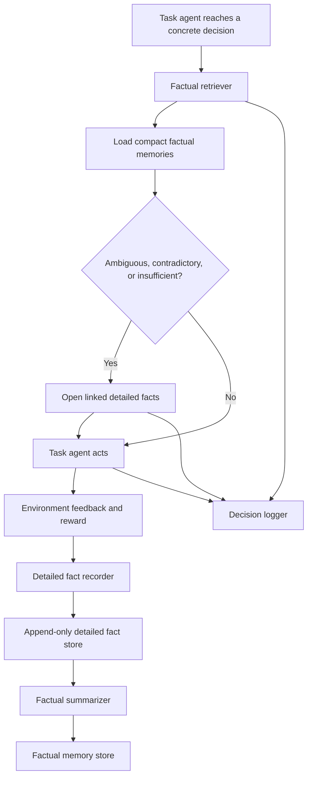
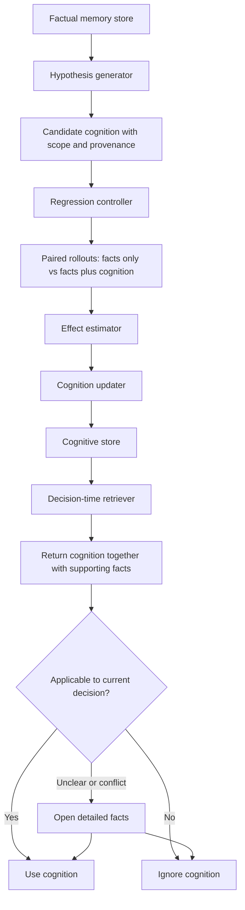

# Agentic Hierarchical Memory for LatentGym

## Implementation and Experiment Plan

**Status:** working design specification  
**Initial environment:** `number_guessing`  
**Primary objective:** first determine whether explicit factual memory improves cross-task performance, before introducing cognitive memory or RL  
**Second objective:** add evidence-grounded cognitive memory with regression testing and decision-time applicability checks  
**Longer-term objective:** use the same environment and evaluation framework for RL-managed memory and, later, latent or differentiable memory architectures

---

## 0. Instructions for Cursor

Before editing code:

1. Read the repository's top-level `README.md`.
2. Read `docs/getting_started.md`.
3. Read `latentgym/eval/README.md`, especially:
   - single-agent evaluation flow;
   - `APIRunner`;
   - `TrajectoryResult` and `EpisodeOutcome`;
   - saved trajectory and reporting formats.
4. Read `latentgym/envs/number_guessing/README.md` and the corresponding environment implementation.
5. Read:
   - `latentgym/eval/single_agent/api_runner.py`;
   - `latentgym/eval/types.py`;
   - `latentgym/eval/orchestrator.py`;
   - `latentgym/eval/model_interface.py`.
6. Locate the exact code path that detects an episode boundary inside a multi-episode trajectory.
7. Determine how the standard runner retains earlier messages across episodes.
8. Do **not** modify the original runner until the baseline evaluation has been reproduced.
9. Implement memory functionality in isolated files and preserve existing APIs wherever possible.
10. Do **not** begin cognitive-memory generation or RL before the factual-memory baselines run end to end.
11. Never expose hidden `ground_truth`, latent values, or future episode configurations to the task agent, recorder, summarizer, retriever, or cognition generator. Hidden information may be used only by the evaluator.

The repository documentation may still refer to an older working-directory name such as `meta-rl`. Use the actual cloned repository root as the working directory.

---

## 1. Research Motivation

LatentGym evaluates whether an agent can improve across a sequence of tasks sharing a hidden latent structure. In the standard single-agent setup, the agent can use the accumulated interaction context.

This project asks whether a more explicit and auditable memory system can replace or improve on raw full-history context.

The staged memory lifecycle is:

```text
interaction trajectory
    -> detailed factual record
    -> compact factual memory linked to the detailed record
    -> decision-time retrieval
    -> optional drill-down when the summary is ambiguous or contradictory
    -> later: candidate cognitive memory grounded in facts
    -> regression validation before broad adoption
    -> decision-time applicability check using the supporting facts
```

The central safety principle is:

> Memory may be useless, but it should not be toxic.

The core distinction is:

- **detailed factual memory** preserves the original evidence;
- **factual memory** is a compact, objective index over that evidence;
- **cognitive memory** is a fallible rule, belief, or strategy inferred from facts.

A cognitive rule is a shortcut, not a replacement for evidence. Even a cognition that passed regression tests must remain linked to the facts that justified it, so the agent can reconsider it when the current context differs or when memories conflict.

### Two separate validation points

The design deliberately keeps two forms of validation:

1. **Formation-time regression validation**
   - asks whether a candidate cognition tends to improve downstream decisions within a tested scope;
   - prevents arbitrary LLM-generated experience from becoming a trusted rule.

2. **Invocation-time applicability judgment**
   - asks whether that cognition applies to the concrete decision currently being made;
   - compares the current context with supporting facts and scope;
   - drills down into detailed facts when summaries are ambiguous or evidence conflicts.

These are complementary. Passing a regression suite does not make a cognition universally correct.

---

## 2. Main Research Questions

The experiments should be staged. Do not require the cognitive layer to answer the first questions.

### Stage A: factual memory

#### RQ1: Does compact factual memory improve over no cross-task memory?

Compare:

- no cross-task memory;
- compact factual memories retrieved at a decision point.

#### RQ2: Can compact factual memory replace raw full history?

Compare under controlled or reported token budgets:

- full interaction history;
- compact factual memories.

#### RQ3: Does hierarchical drill-down improve factual memory?

Compare:

- compact factual summaries only;
- compact factual summaries with access to linked detailed records when the agent detects ambiguity, contradiction, or insufficient evidence.

Measure whether drill-down improves robustness enough to justify its token and tool cost.

### Stage B: cognitive memory

#### RQ4: Does cognitive memory add value beyond its supporting facts?

Under identical factual evidence, compare:

- facts only;
- cognition only;
- facts plus cognition.

This comparison directly tests the concern that skill-like systems may rely on distilled experience while discarding the evidence required to question it.

#### RQ5: Does regression validation reduce toxic cognitive memory?

Compare:

- naive LLM-generated cognition accepted immediately;
- evidence-gated cognition with scope and provenance;
- regression-validated cognition;
- regression-validated cognition plus invocation-time fact checking.

#### RQ6: Which failures dominate?

Separate at least:

- detailed-recording failure;
- factual summarization failure;
- retrieval failure;
- failure to drill down when needed;
- overgeneralized cognition;
- incorrect scope;
- memory-utilization failure;
- stale cognition after latent drift;
- context pollution from irrelevant facts;
- toxic cognition overriding contradictory facts.

### Stage C: learned memory policy

#### RQ7: Which decisions should eventually be learned by RL?

Do not assume the answer in advance. Use the agentic system to determine whether the main bottleneck is:

- selecting factual summaries;
- deciding when to open detailed records;
- generating candidate cognitions;
- promoting, rejecting, or revising cognition;
- deciding whether to use a cognition for the current decision;
- forgetting or invalidating stale cognition;
- selecting regression tests.

---

## 3. Memory Hierarchy and Provenance Graph

The initial implementation has three memory levels. A stable identity or soul layer may exist in a production assistant, but it is fixed and out of scope for the first LatentGym experiments.

### 3.1 Detailed factual memory

Detailed facts preserve the evidence with minimal transformation.

Examples include:

- the original messages in an episode;
- each guess and higher/lower response;
- the exact environment feedback visible to the agent;
- tool output, error text, or user wording in later environments;
- references to the original trajectory and message indices.

A detailed fact should be immutable as an audit record. Corrections are represented by new records or metadata, not silent rewriting.

Example:

```json
{
  "detailed_fact_id": "df_ep3",
  "trajectory_id": "traj_0001",
  "episode_idx": 3,
  "visible_messages": [
    {"role": "assistant", "content": "500"},
    {"role": "environment", "content": "The target is lower."},
    {"role": "assistant", "content": "250"},
    {"role": "environment", "content": "Correct. The target was 250."}
  ],
  "source_type": "agent_visible_transcript"
}
```

### 3.2 Factual memory

Factual memory is a compact, objective summary linked to one or more detailed records.

Its canonical form is:

```text
context + action + observed outcome + source references
```

Facts must not introduce causal explanations, general rules, or advice.

Valid factual memory:

```text
Episode 3; first guess was 500; feedback said lower; the revealed target was 250.
```

Invalid factual memory:

```text
The agent should start below 500 because targets in this session are usually small.
```

The invalid statement belongs in the cognitive layer.

Factual memories may be somewhat compressed or incomplete. When the summary is ambiguous, surprising, contradictory, or high impact, the agent can follow the link to detailed facts.

### 3.3 Cognitive memory

Cognitive memory contains reusable beliefs, strategies, or rules inferred from factual memories.

Every cognitive memory must contain:

- `claim`: what the system currently believes;
- `scope`: conditions under which the claim was tested or observed;
- `action_implication`: how it may change a decision;
- `supporting_fact_ids`: links to compact factual memories;
- `counterevidence_fact_ids`: known conflicting facts;
- `validation_runs`: formation-time regression results;
- `status`: candidate, tentative, validated, revised, rejected, or stale;
- `confidence`: evidence-based support, not LLM self-confidence.

A cognition must not claim validity beyond its tested scope.

### 3.4 Tree-like structure, implemented as a DAG

Conceptually:

```text
cognitive memory
    -> supporting factual memories
        -> detailed factual records
            -> original visible sources
```

In implementation, use IDs and references rather than a strict tree. The structure is usually a DAG because:

- one factual memory may support several cognitions;
- one cognition may depend on several facts;
- one detailed record may generate several factual summaries.

### 3.5 Provenance invariant

Every decision and memory must support this trace:

```text
decision
    -> loaded cognition IDs and factual-memory IDs
    -> supporting factual-memory IDs
    -> detailed-fact IDs
    -> original agent-visible source messages
```

The system should fail loudly when a reference is missing.

---

## 4. Staged Agentic Architecture

### 4.1 Stage A: factual-memory architecture



### 4.2 Stage B: add cognitive memory



### 4.3 Components

1. **Task agent**
   - Existing LatentGym model interface.
   - Solves the game.
   - Model parameters remain frozen in the initial agentic experiments.

2. **Detailed fact recorder**
   - Saves agent-visible trajectory fragments with exact source references.
   - Uses no LLM in Number Guessing v0.

3. **Detailed fact store**
   - Append-only JSON or JSONL for v0.
   - Supports lookup by detailed-fact ID.

4. **Factual summarizer**
   - Produces compact objective records from detailed facts.
   - Deterministic in Number Guessing v0.
   - Later environments may use a constrained LLM call.

5. **Factual memory store**
   - Stores compact facts and links to detailed records.
   - Supports decision-conditioned retrieval.

6. **Drill-down controller**
   - Allows the task agent or deterministic policy to open detailed records.
   - Triggers may include conflict, ambiguity, low confidence, or high-risk decisions.

7. **Decision logger**
   - Records what was retrieved, what was opened, what the model cited, the action, and the outcome.

8. **Hypothesis generator**
   - Added only after factual-memory experiments are stable.
   - Proposes structured, falsifiable candidate cognitions from factual memories.
   - Does not validate its own output.

9. **Regression controller**
   - Ordinary deterministic code.
   - Forks or replays a common prefix into paired suffix rollouts.
   - Tests candidate cognition while holding factual evidence fixed.

10. **Effect estimator**
    - Computes paired downstream effects and harm.

11. **Cognitive store / updater**
    - Stores cognition with tested scope, provenance, and status.
    - Revises scope rather than treating every counterexample as global rejection.

12. **Decision-time cognition checker**
    - Evaluates current applicability.
    - Returns supporting facts with cognition.
    - Opens detailed records when facts and cognition conflict.

---

## 5. Initial Number Guessing Instantiation

Assume a latent such as a recurring target set:

```text
z = {137, 793}
```

A trajectory contains multiple episodes whose targets are sampled from the same latent.

### 5.1 Detailed factual record

```json
{
  "detailed_fact_id": "df_ep0",
  "trajectory_id": "traj_0001",
  "episode_idx": 0,
  "message_refs": [0, 1, 2, 3],
  "visible_transcript": [
    "Agent guessed 500",
    "Environment: lower",
    "Agent guessed 137",
    "Environment: correct; target was 137"
  ],
  "source_type": "agent_visible_transcript"
}
```

### 5.2 Compact factual memory

```json
{
  "fact_id": "f_ep0_outcome",
  "trajectory_id": "traj_0001",
  "episode_idx": 0,
  "context": {
    "environment": "number_guessing",
    "latent_session": "traj_0001",
    "decision_type": "episode_outcome"
  },
  "action": "final guess 137",
  "outcome": "correct target was 137",
  "detailed_fact_ids": ["df_ep0"],
  "verified": true
}
```

After several episodes, the factual memory presented to the agent may be:

```text
Verified records from this trajectory:
- Episode 1 target was 137.
- Episode 2 target was 793.
- Episode 3 target was 137.
```

No rule is asserted yet.

### 5.3 Candidate cognition, added later

```json
{
  "cognition_id": "h1",
  "claim": "Targets may recur from the set of previously observed target values.",
  "scope": {
    "environment": "number_guessing",
    "latent_session": "current trajectory before reset or detected drift"
  },
  "action_implication": "Try previously observed targets before restarting binary search.",
  "supporting_fact_ids": ["f_ep0_outcome", "f_ep1_outcome", "f_ep2_outcome"],
  "counterevidence_fact_ids": [],
  "status": "candidate"
}
```

A plausible but potentially toxic cognition is:

```json
{
  "cognition_id": "h2",
  "claim": "Targets alternate deterministically between the two most recently observed values.",
  "scope": {
    "environment": "number_guessing",
    "latent_session": "current trajectory"
  },
  "action_implication": "Guess the value different from the previous target first.",
  "supporting_fact_ids": ["f_ep0_outcome", "f_ep1_outcome", "f_ep2_outcome"],
  "counterevidence_fact_ids": [],
  "status": "candidate"
}
```

### 5.4 Invocation-time conflict example

Suppose `h2` passed a small early test, but the factual store later contains:

```text
Episode 4 target was 137.
Episode 5 target was also 137.
```

At the next decision, the system should not present `h2` alone. It should return the conflicting facts and allow the agent to inspect the detailed episodes. The likely update is to reject or narrow `h2`, not to ignore the evidence because the rule was previously validated.

---

## 6. Data Schemas

Use dataclasses or Pydantic models, following repository conventions.

### 6.1 `DetailedFact`

```python
@dataclass
class DetailedFact:
    detailed_fact_id: str
    trajectory_id: str
    episode_idx: int
    decision_idx: int | None
    source_type: str
    source_refs: list[dict[str, Any]]
    visible_content: list[dict[str, Any]]
    created_at: str
    metadata: dict[str, Any]
```

### 6.2 `FactualMemory`

```python
@dataclass
class FactualMemory:
    fact_id: str
    trajectory_id: str
    episode_idx: int
    decision_idx: int | None
    context: dict[str, Any]
    action: str | None
    outcome: str
    detailed_fact_ids: list[str]
    verified: bool
    created_at: str
    status: str  # active, corrected, obsolete, archived
```

### 6.3 `CognitiveMemory`

```python
@dataclass
class CognitiveMemory:
    cognition_id: str
    claim: str
    scope: dict[str, Any]
    action_implication: str
    supporting_fact_ids: list[str]
    counterevidence_fact_ids: list[str]
    falsification_condition: str
    status: str
    confidence: float | None
    validation_run_ids: list[str]
    revision_parent_id: str | None
```

### 6.4 `DecisionTrace`

```python
@dataclass
class DecisionTrace:
    decision_id: str
    trajectory_id: str
    episode_idx: int
    decision_type: str
    query: str
    loaded_fact_ids: list[str]
    opened_detailed_fact_ids: list[str]
    loaded_cognition_ids: list[str]
    cited_memory_ids: list[str]
    applicability_judgments: dict[str, str]
    action: str
    outcome: str
    reward: float | None
```

### 6.5 `RegressionRun`

```python
@dataclass
class RegressionRun:
    run_id: str
    cognition_id: str
    source_trajectory_id: str
    fork_episode_idx: int
    suffix_episode_indices: list[int]
    condition: str  # facts_only or facts_plus_cognition
    seed: int
    episode_rewards: list[float]
    episode_turns: list[int]
    first_guess_correct: list[bool]
    memory_token_count: int
    failure_tags: list[str]
```

### 6.6 Reference validation

Add checks enforcing:

```text
cognition -> valid factual-memory IDs
factual memory -> valid detailed-fact IDs
decision trace -> valid loaded-memory IDs
```

---

## 7. Detailed Recording and Factual Summarization

### 7.1 Number Guessing v0: deterministic implementation

Do not use an LLM when the required information is already available in agent-visible feedback.

Record:

- guesses made;
- higher/lower feedback;
- whether the episode was solved;
- target revealed through configured inter-episode feedback;
- number of turns;
- exact visible message references.

Never read evaluator-only fields for the memory pipeline.

### 7.2 Factual-summary constraints

A factual summary must:

- state the context;
- state the action, if relevant;
- state the observed outcome;
- retain links to detailed evidence;
- avoid causes, advice, preferences, or general rules not explicitly stated by the source.

For later environments, use a constrained prompt:

```text
Summarize only factual events explicitly supported by the supplied record.
For each fact return:
- context;
- action;
- observed outcome;
- detailed-record IDs;
- whether the outcome was environment-verified.

Do not infer causes, preferences, rules, advice, or future strategy.
Do not use because, therefore, should, always, generally, or likely unless quoting a source and marking it as a quote.
Return valid JSON only.
```

### 7.3 Detailed drill-down

The first implementation may use a simple rule:

Open a detailed fact when at least one condition holds:

- two retrieved factual summaries appear inconsistent;
- a summary omits information needed for the current decision;
- a retrieved cognition conflicts with a fact;
- the task agent explicitly requests evidence;
- the action is designated high risk;
- the factual summary was generated with low confidence.

For Number Guessing, first implement an explicit tool-like call:

```text
OPEN_DETAILED_FACT <fact_id>
```

The runner resolves the fact ID and returns only the linked agent-visible record.

---

## 8. Stage A: Factual-Memory Experiments

The first experiments should stop here. They do not require cognitive memory.

### 8.1 Conditions

1. **No cross-task memory**
   - clear earlier episode context;
   - each episode begins without past records.

2. **Full history**
   - existing LatentGym single-agent behavior.

3. **Compact factual memory**
   - remove raw prior dialogue;
   - inject retrieved factual summaries only.

4. **Detailed factual memory only**
   - provide raw linked records without compact summaries;
   - useful mainly as an ablation because it may be expensive.

5. **Hierarchical factual memory**
   - provide compact factual summaries;
   - allow selective drill-down to detailed records.

6. **Matched-budget factual memory**
   - compare full history and factual memory under an approximately matched token budget where feasible.

### 8.2 Primary metrics

- cumulative reward;
- per-episode reward;
- final-episode reward;
- success rate;
- mean turns;
- first-guess accuracy;
- factual-memory token cost;
- detailed-fact drill-down count and token cost;
- irrelevant-memory load rate;
- contradiction-resolution rate;
- severe memory harm rate.

### 8.3 Acceptance criteria before Stage B

Proceed to cognitive memory only after:

- factual records contain no hidden ground truth;
- factual summaries can be traced to detailed records;
- no-memory, full-history, and factual-memory conditions run on identical trajectory files;
- at least one factual-memory condition produces interpretable behavior, even if it does not beat full history;
- failures can be attributed to recording, summarization, retrieval, utilization, or drill-down.

A null result is still useful. If facts do not help, investigate why before adding cognition.

---

## 9. Stage B: Hypothesis and Cognitive-Memory Generation

The generator consumes selected factual memories, not raw evaluator state.

### Required output

```json
{
  "claim": "...",
  "scope": {"...": "..."},
  "action_implication": "...",
  "supporting_fact_ids": ["..."],
  "falsification_condition": "...",
  "initial_status": "candidate"
}
```

### Prompt template

```text
You are a hypothesis generator, not a validator.

Given the verified factual memories below, propose at most TWO candidate cognitive memories that may improve future decisions.

Each candidate must:
1. be supported by at least two listed facts;
2. state a narrow scope no broader than the evidence;
3. specify how it may change a future action;
4. specify what future observation would falsify it;
5. cite fact IDs exactly;
6. remain tentative;
7. avoid claiming causality unless the evidence supports it.

Also include one plausible alternative hypothesis when the evidence admits multiple interpretations.
Return JSON only.
```

### Initial debugging order

1. Test one handwritten useful cognition.
2. Test one handwritten plausible-but-wrong cognition.
3. Confirm that facts plus invocation-time checking can expose contradictions.
4. Confirm that the regression harness distinguishes benefit from harm.
5. Only then enable automatic LLM hypothesis generation.

---

## 10. Formation-Time Regression Validation

Regression validation remains part of the design. It is not replaced by invocation-time reasoning.

### 10.1 Core paired design

After observing a prefix of `k` episodes:

1. Freeze the factual memories and candidate cognition.
2. Use the same held-out trajectory suffix for both conditions.
3. Run:
   - **Control:** factual memories only;
   - **Treatment:** identical factual memories plus one candidate cognition.
4. Keep model, environment configuration, target sequence, and sampling configuration as equal as possible.
5. Repeat across many trajectory seeds.

```text
common prefix episodes 0 ... k-1
                |
                +--> control suffix: facts only
                |
                +--> treatment suffix: same facts + candidate cognition
```

### 10.2 Safe replay

Prefer two fresh environments created from the same saved trajectory JSON and deterministic replay of the common prefix unless the environment supports safe state serialization.

Abort a pair when suffix states do not match.

### 10.3 Treatment prompt

```text
Candidate cognitive memory:
- Claim: ...
- Tested scope: ...
- Suggested action implication: ...

Supporting factual records:
- ...

This is fallible guidance, not a command. Current explicit evidence overrides it.
You may request the linked detailed records if the summaries are insufficient or contradictory.
```

### 10.4 Test categories

Eventually include:

- positive / in-scope tests;
- irrelevant tests;
- boundary tests;
- latent-drift tests;
- distractor tests;
- cognition-corruption tests.

### 10.5 Effect estimation

Primary paired effect:

```text
Delta_reward(h) = suffix_reward(facts + h) - suffix_reward(facts only)
```

Also compute:

- paired difference in mean turns;
- first-guess accuracy difference;
- success-rate difference;
- harm rate;
- severe harm rate;
- memory token cost;
- stale-memory recovery speed.

### 10.6 Non-RL status update

Use transparent states:

- `validated_within_scope`;
- `revised`;
- `rejected`;
- `tentative`;
- `stale`.

Report confidence intervals and paired-difference distributions before hard-coding thresholds.

---

## 11. Invocation-Time Applicability Judgment

A cognition that passed regression tests is still not automatically applicable.

At a concrete decision point:

1. retrieve candidate or validated cognitions matching the current decision;
2. retrieve their supporting factual memories at the same time;
3. compare the current context with the cognition's tested scope;
4. look for conflicting or newer facts;
5. open linked detailed facts when ambiguity remains;
6. explicitly choose:
   - use cognition;
   - ignore cognition;
   - use only part of it;
   - revise scope;
   - mark stale or contradicted.

The decision trace should record this applicability judgment.

### Important experimental comparison

Compare:

- cognition only;
- facts only;
- cognition plus supporting facts;
- cognition plus facts plus selective detailed drill-down.

This directly tests whether fact retention makes experience safer and more adaptable than skill-like memory alone.

---

## 12. Retrieval Design

### 12.1 Principle

Retrieve memory when the task agent faces a concrete decision:

```text
I am about to choose action X. Which past facts or tested cognitions could change this action?
```

Avoid broad topic-similarity retrieval only at task start when the decision is underspecified.

### 12.2 Stage A retrieval

Before the first strategic action of an episode:

1. retrieve up to `K` factual summaries from the current trajectory/session;
2. rank surprising outcomes and failures above routine events;
3. allow the agent to request a linked detailed record;
4. log exactly what was loaded and opened.

For the first implementation, retrieval can be deterministic because Number Guessing has a small store.

### 12.3 Stage B retrieval

When cognition exists:

1. retrieve cognition matching the decision context;
2. always return supporting factual memories with it;
3. return counterevidence when available;
4. permit detailed drill-down;
5. do not let cognition silently override newer explicit facts.

### 12.4 Initial ranking features

Use deterministic features first:

- same environment;
- same trajectory or latent session;
- same decision type;
- verified outcomes;
- surprising outcomes and failures;
- recency as a weak tiebreaker;
- past successful use.

Do not add a learned retriever initially.

---

## 13. Provenance and Self-Correction

Every decision should log:

- retrieved factual memories;
- opened detailed records;
- retrieved cognitive memories;
- memories explicitly cited or referenced by the task agent;
- applicability judgments;
- action;
- reward and outcome.

Use these logs to support:

- down-ranking facts repeatedly loaded but never useful;
- identifying summaries that repeatedly force detailed drill-down;
- lowering confidence in cognitions repeatedly present in failed decisions;
- tracing failure to a cognition, factual summary, or original record;
- retracting a cognition and finding prior decisions that depended on it;
- rebuilding cognition from the factual stores;
- marking stale or obsolete facts without destroying the audit trail.

---

## 14. Experimental Conditions by Stage

### 14.1 Stage A: factual memory

Minimum set:

1. no memory;
2. full history;
3. compact factual memory;
4. detailed facts only;
5. hierarchical facts with drill-down;
6. oracle factual summary, if needed to separate summarization failure from memory utility.

Key ablations:

- facts with versus without source references;
- deterministic summaries versus LLM summaries;
- episode-start retrieval versus first-decision retrieval;
- raw history versus compact facts under matched budget;
- always-open details versus selective drill-down;
- conflict-present versus conflict-absent trajectories.

### 14.2 Stage B: cognition

Minimum set:

1. facts only;
2. cognition only;
3. facts plus naive cognition;
4. facts plus evidence-gated cognition;
5. facts plus regression-validated cognition;
6. validated cognition plus invocation-time fact checking;
7. oracle cognition;
8. toxic cognition.

Key ablations:

- cognition with versus without supporting facts;
- cognition with versus without explicit scope;
- cognition with versus without detailed drill-down;
- regression validation with only positive tests versus positive plus boundary/drift tests;
- current-session scope versus global scope.

---

## 15. Evaluation Protocol

### Debug stage

- environment: `number_guessing`;
- one easy recurring-set latent;
- 3 to 5 trajectories;
- deterministic or low-temperature task agent;
- manually inspect every trajectory and provenance chain.

### Factual-memory pilot

- 30 to 50 trajectories per condition;
- fixed trajectory files shared across conditions;
- several memory budgets;
- at least one stationary and one drift/conflict setting;
- complete Stage A before enabling automatic cognitive memory.

### Cognitive-memory pilot

- use the same factual-memory pipeline;
- several prefix lengths `k`;
- handwritten good and toxic cognitions first;
- paired regression suffixes;
- LLM-generated cognition only after the harness is verified.

### Main stage

- relevant Number Guessing latents;
- held-out latents for generalization;
- 100+ paired trajectories where affordable;
- a second LatentGym environment only after the pipeline is stable.

### Report

Produce:

- overall metrics table;
- per-episode reward and turn curves;
- factual-memory retrieval and drill-down statistics;
- paired cognition-effect plots;
- harm-rate table;
- cognition survival and revision table;
- qualitative provenance traces for successes and failures.

---

## 16. Suggested Repository Layout

Add isolated modules first:

```text
latentgym/
├── memory/
│   ├── __init__.py
│   ├── types.py
│   ├── detailed_fact_recorder.py
│   ├── detailed_fact_store.py
│   ├── factual_summarizer.py
│   ├── factual_store.py
│   ├── factual_retriever.py
│   ├── drilldown_controller.py
│   ├── decision_logger.py
│   ├── hypothesis_generator.py
│   ├── cognitive_store.py
│   ├── cognition_checker.py
│   ├── regression_controller.py
│   ├── effect_estimator.py
│   └── prompts/
│       ├── summarize_facts.txt
│       └── generate_hypotheses.txt
│
├── eval/
│   └── memory_agent/
│       ├── __init__.py
│       ├── runner.py
│       ├── paired_runner.py
│       └── metrics.py
│
├── configs/
│   └── eval_suites/
│       └── memory_number_guessing.yaml
│
└── experiments/
    └── memory/
        ├── run_factual_baselines.py
        ├── run_cognitive_regression.py
        └── analyze_effects.py

tests/
└── memory/
    ├── test_no_ground_truth_leakage.py
    ├── test_detailed_fact_roundtrip.py
    ├── test_factual_constraints.py
    ├── test_provenance.py
    ├── test_drilldown.py
    ├── test_paired_runner.py
    └── test_status_transitions.py
```

Follow existing repository test conventions if they differ.

---

## 17. Integration Points with Existing LatentGym

Expected existing flow:

```text
BenchmarkOrchestrator
  -> make_env(config, trajectory_path)
  -> APIRunner.run_trajectory(env)
  -> env.init()
  -> model.generate(messages)
  -> env.step(action)
  -> TrajectoryResult
```

The memory-aware runner should:

1. reuse the existing `ModelInterface`;
2. reuse environment construction and trajectory files;
3. preserve `TrajectoryResult` compatibility where possible;
4. add detailed-fact, factual-memory, cognition, and decision logs as optional metadata;
5. hook into episode and decision boundaries;
6. control raw-history retention or clearing between episodes;
7. inject retrieved facts without exposing evaluator-only fields;
8. expose a safe detailed-fact lookup tool;
9. later support cognition together with its evidence.

Before coding, Cursor must identify the exact episode-boundary signal and document it.

---

## 18. Step-by-Step Implementation Plan

### Phase 0: reproduce LatentGym

Acceptance criteria:

- installation succeeds;
- mock-model sanity check succeeds;
- one Number Guessing evaluation succeeds;
- trajectory JSON or viewer works;
- exact episode-boundary and message-retention paths are documented.

### Phase 1: detailed and compact factual stores

Tasks:

- add `DetailedFact` and `FactualMemory` schemas;
- implement append-only serialization;
- implement deterministic Number Guessing recording and summarization;
- add provenance validation;
- add decision logging.

Acceptance criteria:

- every compact fact resolves to agent-visible detailed evidence;
- no inferred advice enters the factual layer;
- hidden evaluator fields never enter memory.

### Phase 2: factual retrieval and hierarchical drill-down

Tasks:

- implement no-memory, full-history, compact-fact, detailed-only, and hierarchical-fact conditions;
- retrieve before the first strategic decision;
- implement `OPEN_DETAILED_FACT` or equivalent;
- measure retrieval and drill-down cost;
- add conflict and drift cases.

Acceptance criteria:

- identical trajectory files are reused across conditions;
- the system can identify when a factual summary is insufficient;
- performance and cost differences are interpretable;
- Stage A results are reviewed before cognitive-memory work begins.

### Phase 3: handwritten cognition and paired regression

Tasks:

- add one useful and one toxic handwritten cognition;
- link each to factual support;
- implement common-prefix replay or forking;
- run facts-only versus facts-plus-cognition suffixes;
- compute paired metrics;
- test invocation-time conflict handling.

Acceptance criteria:

- both branches receive identical facts;
- only treatment receives cognition;
- useful and harmful cognition can be distinguished;
- contradictory facts can override cognition at invocation time.

### Phase 4: LLM hypothesis generation and cognitive lifecycle

Tasks:

- implement structured candidate generation;
- validate cited fact IDs;
- cap candidate count;
- add regression status updates;
- add scope revision and stale handling;
- compare cognition-only with facts-plus-cognition.

Acceptance criteria:

- every cognition cites valid facts;
- regression outcomes are attached;
- each use decision records applicability reasoning and evidence access;
- cognitive memory never replaces its factual provenance.

### Phase 5: generalization and learned policy

Tasks:

- test held-out Number Guessing latents;
- add a second environment only after stability;
- identify the concrete routing or consolidation bottleneck;
- select one narrow RL target.

---

## 19. Testing Requirements

### Unit tests

- detailed records contain only agent-visible content;
- stores serialize and deserialize exactly;
- factual memories reference valid detailed facts;
- cognitions reference valid factual memories;
- decision traces reference valid loaded memories;
- control and treatment prompts differ only in intended cognition content;
- paired runs use matching suffixes;
- status transitions are valid;
- the factual layer rejects or flags inferential language where feasible.

### Integration tests

- mock model completes one memory-aware trajectory;
- deterministic Number Guessing recording works;
- compact facts can be retrieved;
- detailed drill-down returns the correct source record;
- paired cognition regression produces two branch results and one effect record;
- reporting can load results without breaking existing output.

### Failure behavior

- invalid LLM JSON: retry once, then mark generation failure;
- missing provenance: reject the summary or cognition;
- replay mismatch: abort the pair;
- API failure in one branch: rerun or discard the entire pair;
- duplicate facts: preserve all source references but deduplicate presentation;
- ambiguous fact: keep the detailed record and mark the summary for drill-down rather than inventing certainty.

---

## 20. Later RL Extension

Only begin RL after the staged agentic experiments reveal a specific bottleneck.

LatentGym's existing cross-task RL should be reused as infrastructure and as a full-history RL baseline, but it does not by itself define explicit memory actions.

### 20.1 Candidate RL problem A: factual routing and drill-down

This is a natural first target if factual memory already improves performance.

State:

- current concrete decision;
- available factual summaries;
- links to detailed records;
- contradiction and uncertainty signals;
- memory/token budget;
- prior use statistics.

Actions:

- retrieve factual-memory IDs;
- open a detailed fact;
- stop retrieving and act.

Reward:

```text
task reward
- factual retrieval cost
- detailed drill-down cost
- memory-induced harm
```

This trains when to rely on summaries and when to inspect evidence.

### 20.2 Candidate RL problem B: cognition applicability

State:

- current decision context;
- candidate cognition and tested scope;
- supporting and counterevidence facts;
- optional detailed records;
- memory budget.

Actions:

- use cognition;
- ignore cognition;
- open supporting detailed facts;
- revise scope;
- mark stale.

Reward:

- downstream task reward;
- minus harm caused by incorrect transfer;
- minus retrieval and drill-down cost.

### 20.3 Candidate RL problem C: cognitive promotion

State:

- candidate cognition;
- supporting and counterevidence facts;
- prior regression outcomes;
- current scope;
- remaining validation budget.

Actions:

- test now;
- keep tentative;
- promote within scope;
- revise scope;
- reject;
- mark stale.

Reward:

- paired downstream improvement;
- minus cognition-induced harm;
- minus validation cost and memory cost.

### 20.4 Candidate RL problem D: regression-test selection

State:

- unvalidated cognitions;
- uncertainty and potential impact;
- available positive, boundary, drift, and corruption tests;
- remaining test budget.

Actions:

- select cognition to test;
- select test type;
- stop testing.

Reward:

- information gained about utility and scope;
- future downstream reward;
- minus test cost.

### 20.5 Selecting the first RL target

Use experimental evidence:

- if compact facts help but retrieval/drill-down is inefficient, train factual routing;
- if correct cognition helps but context transfer is unsafe, train applicability checking;
- if candidate quality is adequate but promotion is unreliable, train promotion/rejection;
- if validation is too expensive, train experiment selection.

Do not jointly train task policy, retrieval, summarization, cognition generation, and validation in the first RL experiment.

### 20.6 Offline data from the agentic phase

Records may include:

```text
current decision
retrieved factual summaries
opened detailed facts
candidate cognition
supporting and contradictory evidence
with/without cognition rollouts
paired effect
harm tags
applicability decision
final memory status
```

Use these data for:

- supervised routing or ranking;
- value-model training;
- offline policy learning;
- warm-starting sequence-level RL.

### 20.7 Online sequence-level RL

Possible explicit actions at decision or episode boundaries:

```text
<MEMORY_ACTION>
RETRIEVE_FACT f12
OPEN_DETAILED_FACT df7
USE_COGNITION h1
IGNORE_COGNITION h2
REVISE_SCOPE h3 current_session_only
</MEMORY_ACTION>
```

Prefer freezing the task agent or training a small router/adapter so improvements are attributable to memory policy.

---

## 21. Later Differentiable-Memory Extension

Keep the environment, evaluation protocol, provenance, and staged factual/cognitive distinction independent of memory representation.

Possible backends:

1. natural-language detailed facts, facts, and cognition;
2. structured symbolic memory;
3. soft-prompt vectors;
4. prefix key/value memory;
5. cross-attention memory bank;
6. learned differentiable consolidation.

Abstract interface:

```python
class MemoryBackend(Protocol):
    def observe(self, trajectory_fragment: Any) -> None: ...
    def summarize_facts(self) -> list[Any]: ...
    def retrieve(self, decision_context: Any, budget: int) -> Any: ...
    def open_detail(self, memory_id: str) -> Any: ...
    def consolidate(self) -> list[Any]: ...
    def update_from_outcome(self, decision_trace: Any) -> None: ...
    def snapshot(self) -> Any: ...
    def restore(self, snapshot: Any) -> None: ...
```

The first implementation returns text, but runner code should not assume memory must always be natural language.

---

## 22. Commands to Run First

After cloning and following the repository's current setup guide, use repository-provided commands.

```bash
# Read current instructions first
sed -n '1,240p' docs/getting_started.md
sed -n '1,260p' latentgym/eval/README.md
sed -n '1,260p' latentgym/envs/number_guessing/README.md

# List number-guessing latents
python -m latentgym.cli.generate_data list --env number_guessing

# Generate a very small evaluation set
python -m latentgym.cli.generate_data eval \
  --env number_guessing \
  --n-trajectories 3 \
  --num-episodes 5 \
  --output latentgym/data/eval/

# Run a no-cost mock sanity check; confirm current model-spec syntax in docs
python -m latentgym.cli.run_eval single \
  --models mock:random \
  --env number_guessing \
  --n-trajectories 3 \
  --num-episodes 5 \
  --trajectory-dir latentgym/data/eval/ \
  --output latentgym/results/memory_sanity/

# Build a trajectory report
python -m latentgym.cli.report \
  --data-dir latentgym/results/memory_sanity/ \
  --trajectories \
  --output latentgym/results/memory_sanity/report/
```

Confirm exact latent, prompt, and feedback IDs from the cloned repository before committing experiment configs.

---

## 23. First Cursor Tasks

### Task 1: inspect without editing

```text
Read AGENTIC_MEMORY_PLAN.md and the LatentGym files listed in Section 0.
Do not modify code yet.

Produce a repository-specific implementation note that answers:
1. What exact class and method run a single multi-episode trajectory?
2. How is an episode boundary detected?
3. How are messages retained across episodes?
4. Which fields are agent-visible, and which are evaluator-only ground truth?
5. What is the safest way to replay or fork a trajectory prefix?
6. Which existing result dataclasses can be extended without breaking reporting?
7. What minimal new files are needed for Phase 1?

Cite local file paths and line ranges.
Do not propose RL, cognition generation, or task-environment changes.
```

### Task 2: implement Phase 1 only

After reviewing Task 1:

```text
Implement only the detailed factual record and compact factual memory pipeline for Number Guessing.

Requirements:
- use agent-visible transcript content only;
- deterministic extraction and summarization;
- append-only JSON/JSONL storage;
- complete detailed-to-summary provenance;
- no cognitive memory;
- no RL;
- no learned retriever;
- preserve existing LatentGym results and add optional memory metadata;
- add tests for leakage, provenance, serialization, and factual-language constraints.
```

---

## 24. Success Criteria

### Stage A factual-memory MVP

The first MVP succeeds if:

1. detailed factual records preserve agent-visible evidence;
2. compact factual memories are traceable to detailed records;
3. factual memory can replace raw history in a controlled condition;
4. the task agent can selectively open detailed records;
5. performance, token cost, and harm can be compared against no memory and full history;
6. failures can be assigned to recording, summarization, retrieval, drill-down, or utilization.

The factual MVP does **not** require cognitive memory, regression testing of cognition, or RL.

### Stage B cognitive extension

The cognitive extension succeeds if:

1. candidate cognition is grounded in valid factual memories;
2. paired regression estimates its downstream contribution while holding facts fixed;
3. cognition-only and facts-plus-cognition can be compared;
4. the agent can reject a previously validated cognition when current facts conflict;
5. detailed evidence can resolve ambiguity;
6. cognition status and scope can be revised without losing provenance;
7. the system reveals a narrow bottleneck suitable for later RL.

The project does not need to prove that Number Guessing transfers directly to coding agents or that differentiable memory is unnecessary.

---

## 25. Open Design Questions

### Factual memory

- Does compact factual memory improve over no memory?
- Can it match full history at lower token cost?
- Which factual granularity is useful: episode outcome, full action sequence, or both?
- When does a compact summary become too ambiguous?
- Can the task agent reliably decide when to open a detailed record?
- Is first-decision retrieval sufficient, or are later decision points necessary?
- How should conflicting factual summaries be presented?
- Does hierarchical factual memory help under latent drift?

### Cognitive memory

- Does cognition add value once the agent already has facts?
- Is cognition-only more brittle than facts plus cognition?
- How many supporting facts are enough to generate a candidate?
- How should tested scope be represented?
- Does regression validation overfit to the test suite?
- What should happen when current facts contradict a validated cognition?
- Can the task agent report which memory it used, or is behavioral attribution required?

### RL

- Is the first meaningful learned action retrieval, drill-down, applicability checking, promotion, or test selection?
- Can the task agent remain frozen while a small memory router is trained?
- Should reward use absolute downstream performance or paired memory contribution?
- How should retrieval and detailed-evidence costs be priced?

These questions are outputs of the staged experiments, not assumptions to settle in advance.
