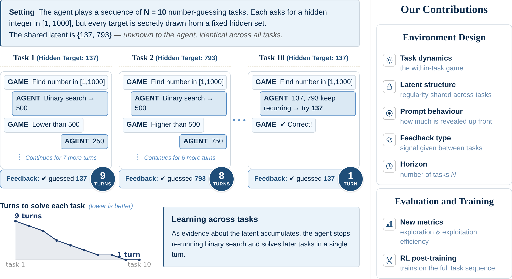

<div align="center">

# LatentGym: A Testbed For Cross-Task Experiential Learning With Controllable Latent Structure

[](https://arxiv.org/abs/XXXX.XXXXX)
[](https://example.com/blog)
[](https://huggingface.co/collections/namkoong-lab/latentgym-6a22ddf5339b7ef0423934c6)
[](https://www.python.org/downloads/release/python-3127/)
[](LICENSE)



<p align="left"><sub><b>Left:</b> Number-guessing illustration. Across N=10 tasks, targets are secretly drawn from a fixed hidden set (here, {137, 793}). Early on the agent runs binary search (9 turns); by task 10 it has learned the recurring set and solves in 1 turn. <b>Right:</b> Each environment in our framework factorizes along controllable axes (task dynamics, prompt behavior, feedback type, and horizon), letting us study how frontier LLM agents adapt across tasks and train them via RL on full task sequences (Cross-Task RL).</sub></p>

</div>

<!--
TODO (figures): consider adding a SECOND figure below the hero:
  - Screenshot of the trajectory-viewer / interactive dashboard
    (latentgym/app/app.py Streamlit pages or the static trajectory_explorer.html),
    showing how to observe model behavior turn by turn.
  Drop it into assets/ and reference here.
-->

---

## Latest Updates

- 🚀 **06/08/2026**: Released **LatentGym** along with the accompanying paper preprint on arXiv.

## About

This repo accompanies the paper *LatentGym: A Testbed For Cross-Task Experiential Learning With Controllable Latent Structure* (Mittal, Castellani, Yen et al., 2026). LatentGym is a controllable suite for studying whether LLM agents can learn *how to learn* across tasks: each environment is organized around a ground-truth latent variable that governs the structure shared across a sequence of related tasks, and the agent is rewarded for inferring that latent from experience and exploiting it on later tasks.

LatentGym spans 7 text-based environments (bandits, wordle, hangman, mastermind, secretary, wordladder, number-guessing) with 421 controllable latents. Each environment factorizes along independently swappable axes: latent (hidden ground-truth pattern), prompt (how much the agent is told about the latent up front), feedback (what is revealed across tasks), and episode count. Our construction yields metrics that separate **exploration** (whether the agent's actions gather information about the latent) from **exploitation** (whether the agent uses what it has gathered). We use the suite to (1) evaluate frontier LLMs on cross-task adaptation, (2) train models with RL on full task sequences ("Cross-Task RL"), and (3) study how design choices (prompt richness, inter-task feedback) shape training dynamics and generalization.

## Structure

- [Setup & repo layout](docs/getting_started.md): install, common commands, pipeline overview
- [Evaluation](latentgym/eval/README.md): single/double-agent, OpenRouter/local, reports, dashboard
- [Training](latentgym/training/README.md): single-GPU + FSDP, parquet format, adding algorithms
- [Environments](latentgym/envs/README.md): 5 axes, 7 envs, adding a new env

## Citation

```bibtex
@misc{mittal2026latentgymtestbedcrosstaskexperiential,
      title={LatentGym: A Testbed For Cross-Task Experiential Learning With Controllable Latent Structure}, 
      author={Daksh Mittal and Tommaso Castellani and Thomson Yen and Naimeng Ye and Fangyu Wu and Minghui Chen and Tiffany Cai and Emmanouil Koukoumidis and William Zeng and Hongseok Namkoong},
      year={2026},
      eprint={2606.15306},
      archivePrefix={arXiv},
      primaryClass={cs.LG},
      url={https://arxiv.org/abs/2606.15306}, 
}
```

## Acknowledgements

This work builds on two open-source projects:

- **[SkyRL](https://github.com/NovaSky-AI/SkyRL)** by NovaSky-AI: a modular full-stack RL library for LLMs. We use `SkyRL-Train v0.2.0`.
- **[TextArena](https://github.com/LeonGuertler/TextArena)** ([paper](https://arxiv.org/abs/2504.11442)) by Guertler et al.: a collection of competitive text-based games for LLM evaluation and RL. We use a local copy of the package, with adaptations that make environments multi-episode.
